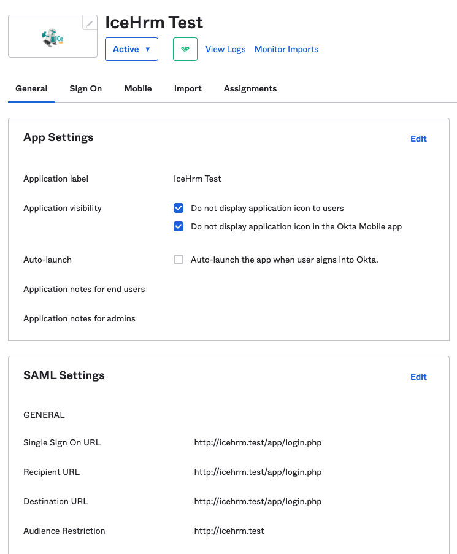
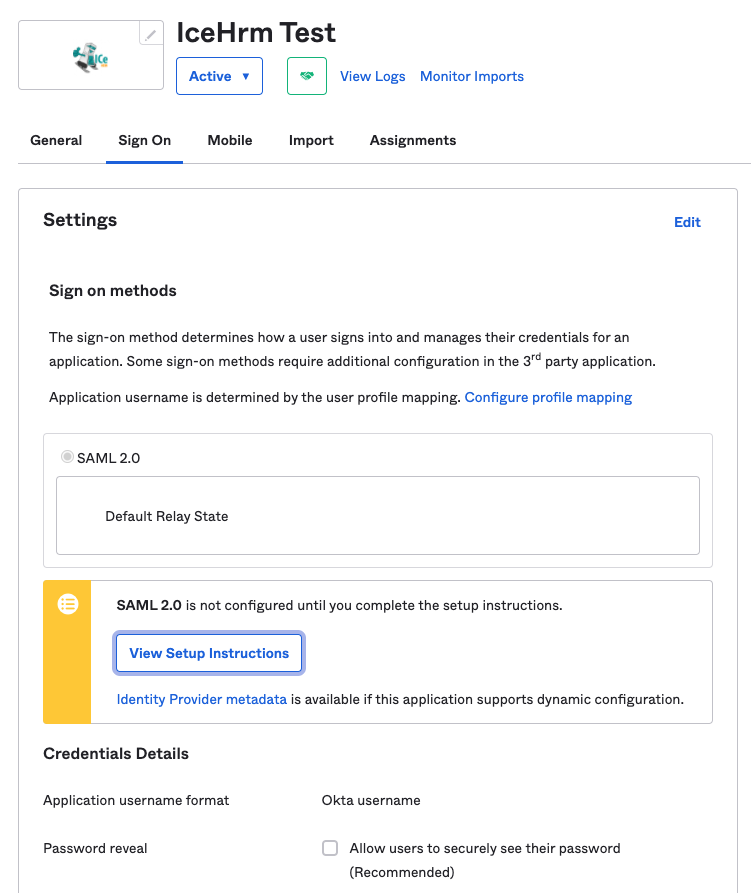
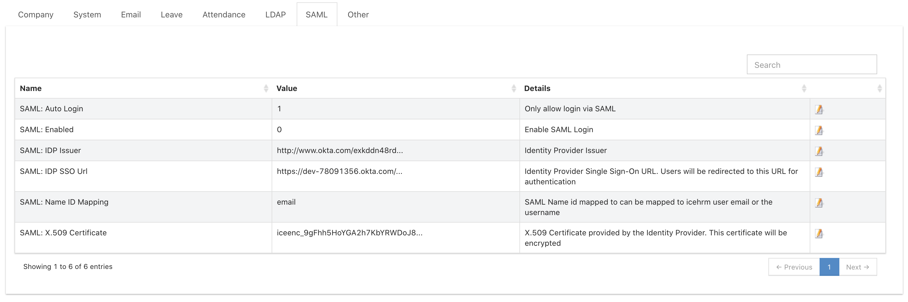
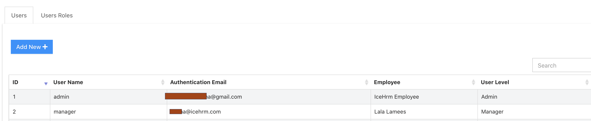
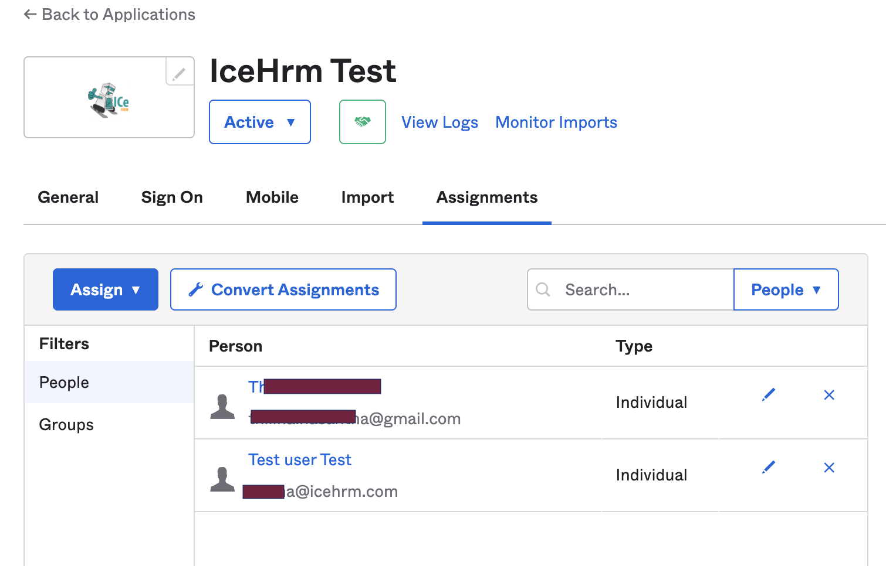

# Sign-In with SAML (Okta)


IceHrm SAML integration only works with IceHrmPro and IceHrm Open Source. This integration will not work with IceHrm Cloud installtions


## Creating a Test SAML Application in Okta

Since you are trying to integrate IceHrm with Okta SAML you should already have a SAML Application created with Okta. But if you don't have an application here is a guide to create your SAML Application: [https://developer.okta.com/docs/guides/build-sso-integration/saml2/create-your-app/](https://developer.okta.com/docs/guides/build-sso-integration/saml2/create-your-app/)

### Configuring the Okta Application

This section describes how to configure the Okta SAML application so it can perform authentication for IceHrm.


We assume your icehrm URL is [http://icehrm.test](http://icehrm.test). Please replace this with your domain.


1. On your Okta application following parameters should be set accordingly.

```
Single Sign On URL => http://icehrm.test/app/login.php
Recipient URL => http://icehrm.test/app/login.php
Destination URL => http://icehrm.test/app/login.php
Audience Restriction => http://icehrm.test
```



2\. Then under the "Assignments" tab you need to add some users to this application. Make sure the email \[SAML name id] of these users are the same as the login email for IceHrm.

### Extract Required Configuration from Okta SAML Application

1. Go to the "Sign On" section of your Okta Application



&#x20;2\. Click "View Setup Instructions" button. This will take you to a page with some configurations you need to update on IceHrm

### Update IceHrm SAML Configuration

1. Under the System -> Settings, SAML tab update the configuration using the values in previous step.



2\. Assign users to your Okta SAML application under "Assignments" tab. **Make sure the name id of the assigned user matches the email of a user registered in IceHrm user** under System -> Users





### Enable SAML Sign-In

1. Under System -> Settings -> SAML tab set **"SAML: Enabled"** and **"SAML: Auto Login"** to "1".
2. Then visit your IceHrm login page and you should be redirected to Okta login page.
3. Login in using your Okta credentials.

&#x20;
