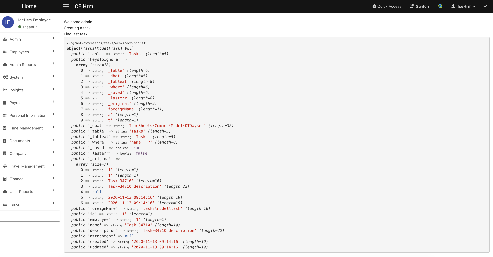

# Adding Entries to DB

## Introduction

Let's check how we can add data into the newly created table

### Add a Model Class

In order to communicate with the database you need a model. IceHrm uses AdoDB as the ORM. But it provides an abstraction layer on top of AdoDB.

```
icehrm
    |--extnsions
          |--tasks
               |--src
                  |--Tasks
                       |--Model
                            |--Task.php
                       |--Extension.php
                       |--Migration.php
               |--meta.json
```

** Task.php **

```php
<?php

namespace Tasks\Model;

use Classes\ModuleAccess;
use Model\BaseModel;

class Task extends BaseModel
{
    public $table = 'Tasks';
}
```

### Update Extension Include File

#### tasks.php

```
<?php
require_once __DIR__.'/src/Tasks/Extension.php';
require_once __DIR__.'/src/Tasks/Migration.php';
require_once __DIR__.'/src/Tasks/Model/Task.php';
```

### Create a Random Task

Just for testing we will create a new task on the view file itself, and print it on screen.

### web/index.php

```php
<?php
$user = \Classes\BaseService::getInstance()->getCurrentUser();
echo "Welcome ".$user->username."<br/>";

echo "Creating a task <br/>";

$task = new \Tasks\Model\Task();
$taskName = 'Task-'.rand(rand(0, 100), 50000);

$task->name = $taskName;
$task->employee = $user->employee;
$task->description = $taskName.' description';
$task->created = date('Y-m-d H:i:s');
$task->updated = date('Y-m-d H:i:s');

/**
 * Saving the task, $ok will be false if there were any error during the creation
 */
$ok = $task->Save();

if (!$ok) {
    echo "Error: ".$task->ErrorMsg()." <br/>";    
}

echo "Find last task <br/>";

$taskFromDB = new \Tasks\Model\Task();
/**
 * You can use load method to load the first matching task into an empty model
 */
$taskFromDB->Load('name = ?', [$taskName]);

var_dump($taskFromDB);
```


Please find all the code upto this point here: [https://github.com/gamonoid/icehrm/tree/extension-example-models/extensions/tasks](https://github.com/gamonoid/icehrm/tree/extension-example-models/extensions/tasks)



