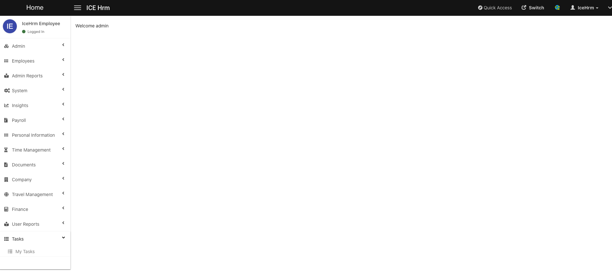

# Creating First Extension

## Introduction

IceHrm extensions allow developers to extend the features offered by IceHrm without making changes to the IceHrm core. Here we will start building an extension to list some tasks for employees

* Create the directory `icehrm/extensions` if it doesn't exist
* Create a directory named `tasks` inside `icehrm/extensions`


Code for this extension is here: [https://github.com/gamonoid/icehrm/tree/feature/custom-extentions-example/extensions/tasks](https://github.com/gamonoid/icehrm/tree/feature/custom-extentions-example/extensions/tasks)


### Add meta.json file 

```
icehrm
    |--extnsions
          |--tasks
               |--meta.json
```

The meta.json file for this extension should look like:

```text
{
    "label": "My Tasks",
    "menu": ["Tasks", "fa-list"],
    "icon": "fa-tasks",
    "user_levels": [
        "Admin",
        "Manager",
        "User"
    ],
    "model_namespace": "\\Tasks\\Model",
    "manager": "\\Tasks\\Extension",
    "headless": false
}

```

* **menu**: the name of the main menu and the icon for the main menu
* **label**: the name of the menu item that will be created by this extension
* **icon**: the icon for the menu that will hold the extension
* **user\_levels**: which types of users will be able to see and use the extension \(in this case Admins / Managers and Employees\)
* **headless**: if true this extension will not have any UI visibility. It'll just function as a background module
* **manager**: the main class which will control the extension
* **model\_namespace**: the namespace which will hold all the database model classes

### Add Extension Manager Class

```text
icehrm
    |--extnsions
          |--tasks
               |--src
                  |--Tasks
                       |--Extension.php
               |--meta.json
```

#### Extension.php

```text
<?php
namespace Tasks;

use Classes\IceExtension;

class Extension extends IceExtension
{

    public function install() {
        
    }

    public function uninstall() {
        
    }

    public function setupModuleClassDefinitions()
    {
    
    }

    public function setupRestEndPoints()
    {
    
    }
}

```

### Add a Simple Migration

This extension will manage tasks. So we might have to make changes to the database. For that we should add a migration. We can use the core migration classes offered by Icehrm.

```text
icehrm
    |--extnsions
          |--tasks
               |--src
                  |--Tasks
                       |--Extension.php
                       |--Migration.php
               |--meta.json
```

#### Migration.php

```text
<?php
namespace Tasks;

use Classes\Migration\AbstractMigration;

class Migration extends AbstractMigration
{
    public function up()
    {
        $sql = <<<'SQL'
create table `Tasks` (
	`id` bigint(20) NOT NULL AUTO_INCREMENT,
	`employee` bigint(20) NULL,
	`name` varchar(250) NOT NULL,
	`description` TEXT NULL,
	`attachment` varchar(100) NULL,
	`created` DATETIME default NULL,
	`updated` DATETIME default NULL,
	primary key  (`id`),
	CONSTRAINT `Fk_EmployeeTasks_Employees` FOREIGN KEY (`employee`) REFERENCES `Employees` (`id`) ON DELETE CASCADE ON UPDATE CASCADE
) engine=innodb default charset=utf8;
SQL;
        return $this->executeQuery($sql);
    }

    public function down()
    {
        $sql = <<<'SQL'
DROP TABLE IF EXISTS `Tasks`; 
SQL;
        return $this->executeQuery($sql);
    }
}
```

This migration will create a table named Tasks in IceHrm database. The migration will be executed only on the first time the extension is enabled. If you are making changes to the migration you need to make sure it gets applied manually.

### Execute Migration when Installing the Extension

For this, we should update the Extension.php a bit:

```text
<?php
namespace Tasks;

use Classes\IceExtension;

class Extension extends IceExtension
{

    public function install() {
        $migration = new Migration();
        return $migration->up();
    }

    public function uninstall() {
        $migration = new Migration();
        return $migration->down();
    }

    public function setupModuleClassDefinitions()
    {

    }

    public function setupRestEndPoints()
    {

    }
}
```

### Adding Extension Include File


Every extension should have an include file with the same name as the extension. In our example, it will be tasks.php


```text
icehrm
    |--extnsions
          |--tasks
               |--src
                  |--Tasks
                       |--Extension.php
                       |--Migration.php
               |--meta.json
               |--tasks.php
```

#### tasks.php

```text
<?php

require_once __DIR__.'/src/Tasks/Extension.php';
require_once __DIR__.'/src/Tasks/Migration.php';

```

### Adding the View file


Every extension must have a view file if it's not running on headless mode. File should always be &lt;extension\_dir&gt;/web/index.php


```text
icehrm
    |--extnsions
          |--tasks
               |--src
                  |--Tasks
                       |--Extension.php
                       |--Migration.php
               |--web
                   |--index.php
               |--meta.json
               |--tasks.php
```

### web/index.php

```text
<?php
$user = \Classes\BaseService::getInstance()->getCurrentUser();
echo "Welcome ".$user->username;

```

Here we use a core class from Icehrm to get the currently logged in user

## Load the Extension in IceHrm

Visit `http://icehrm.os` and you should see the **My Tasks** menu



