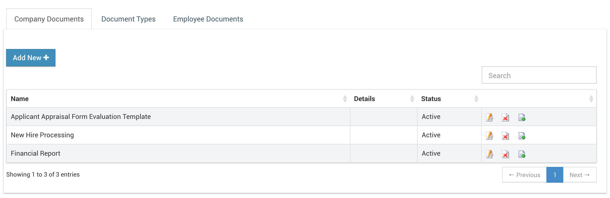
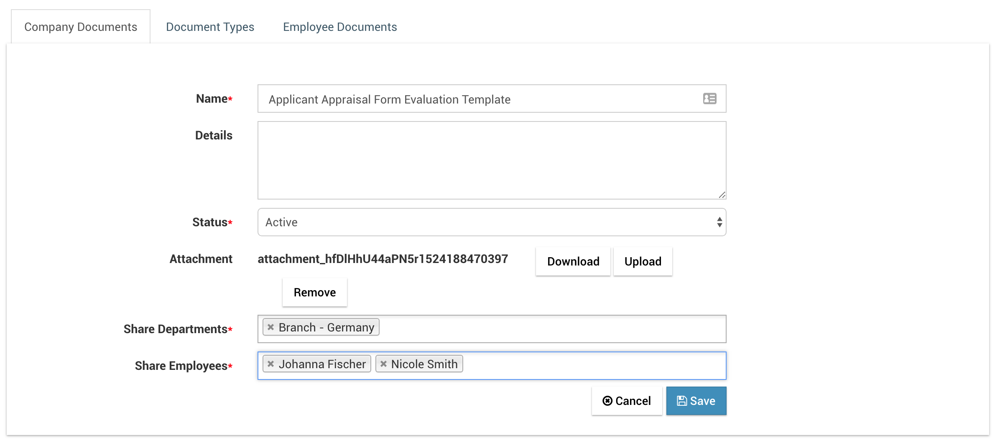
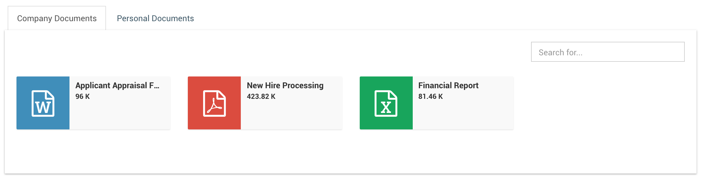
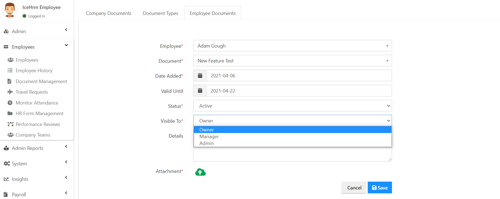

# Document Management

In IceHrm you can manage company documents as well as individual employee documents.

## Company Documents

Company documents can be added via `Employees => Document Management`. Depending on the confidentiality and nature of the document it can be shared only with individual employees, all employees attached to a department or all the employees in the company.

Employees can view company documents via  `Documents => My Documents => Company Documents`

## Employee Personal Documents

### Document Types

Accessed via `Employees => Document Management => Document Types`

Document Types tab is used to define various documents relevant to your organization. The employees are able to upload documents under these categories.

### Expire Notifications

When defining document types you can define before how many days icehrm should notify the user about the expiring documents.

The notification cron should be setup for this feature to function properly. Please check the section \[Cron for Notifications\] \([https://thilinah.gitbooks.io/icehrm-guide/content/installation-and-setup.html](https://thilinah.gitbooks.io/icehrm-guide/content/installation-and-setup.html)\)

### Employee Documents

Administrators and Managers can use "Employee Documents" tab to explore and manage documents uploaded by employees or add new documents to employees.

### Settings

Set `"Notifications: Send Document Expiry Emails"` to No if you don't wish to receive document expiry notifications.

Also set `Notifications: Copy Document Expiry Emails to Manager` to Yes if you want to send all document expiry notifications to respective managers also

### **Personalize the Company Documents**

Using the new IceHrm Document Management module, you can specify documents privacy. 

To find the settings go to the Employee Management module under the Admin account and click on the Document Management module.

If you don't want to share it with your employees:

Set "`Share With Employee option"` to **NO** when you create a new Document Type. 

For any employee document, under a document type with the above-mentioned field set to No will not be displayed to the employee \(document will only be visible to the admin or the manager of the employee\)

### Display a Document to a specific Employee

When you assign the document to an employee you can make it visible to the **Owner**, **Manager** or **Admin**.

Also, you can make it visible to the employees' manager or the Admin.

If you only need to enable this document to the Admin, you can select the option as Admin. So the document will only be visible to the Admin. 

