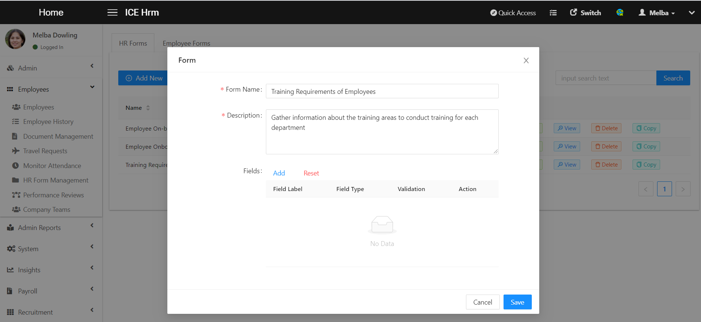
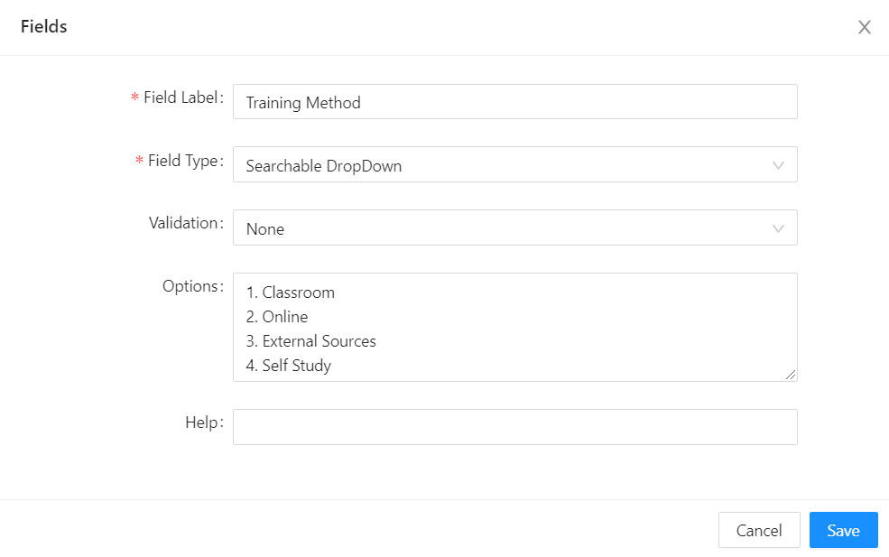
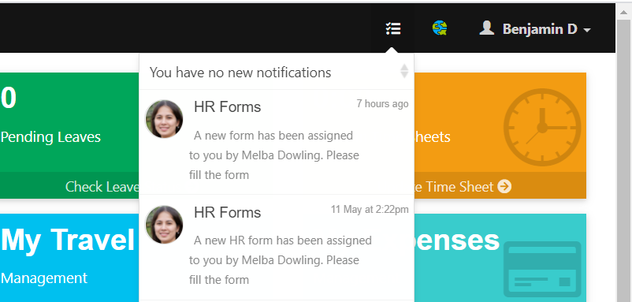
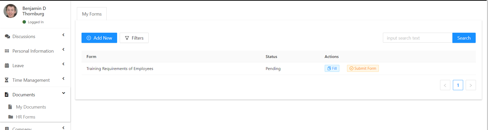
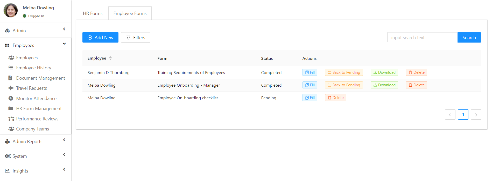

# HR Form Management

> 1. To request employee surveys

> 2. Employees’ opinion on something

> 3. To get probation review forms filled

To create a HR form, log into the admin account and navigate to`Employees -> HR Form Management` or directly click on the HR Form Management icon on the Dashboard. 

Click on Add New under the HR Forms tab. First, name the HR form then you can add a description about the HR form. 

After that click Add on the Field option to create questions to the HR form.

First, you need to add the question under the Field Label then select the relevant Field Type. 

_If you select the Text Area or Multiline Text option, employees will be able to type a single sentence or multiple sentences in order to answer the question._ 

_If you select the Dropdown option which means you can allow employees to select one over options. You can also allow them to select two options by enabling the Searchable dropdown option or select multiple options by enabling the Multiselect option. You can add options under the Options field._ 

This way add all the questions for the HR Form and finally click on Save. 

## How to assign a HR Form to an employee?

Navigate to `Employees->HR form Management->Employee Form->Add New.`

First, select the Employee, then Select the HR form and Staus according to your requirement and finally click on Save. When you assign the HR form the employee will receive a notification.

## How an Employee Can fill the HR Form?

The employee can click on the notification received or navigate to `Documents-> HR Forms->My Forms`.

Then click on the Fill button. After filling the HR Form employee can Save the HR form and then Submit Form.

With the new features of IceHrm HR forms, Admin can change the status of a completed HR form back to Pending.

## How to Download a HR Form as PDF report?

Admin can go to the Employee Forms tab Select the employee HR Form and then click on the Download button. 

