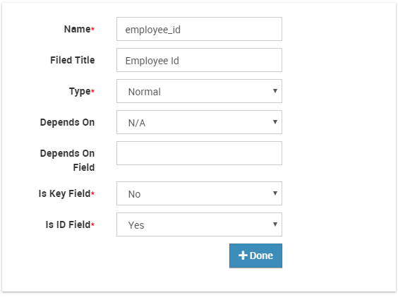

# Employee Data Import

You can import data into icehrm using CSV files. By default, we support importing basic employee details and attendance data. This feature should be used only during the initial setup.

## Preparing Employee Data for Upload

1. Download sample data file [https://docs.google.com/spreadsheets/d/1vCEgc-HbYcYqpeJ0vvPEyO20d75EZhBxFz5MrbM0CQ8/edit?usp=sharing](https://docs.google.com/spreadsheets/d/1vCEgc-HbYcYqpeJ0vvPEyO20d75EZhBxFz5MrbM0CQ8/edit?usp=sharing) \(File -&gt; Download -&gt; Download as CSV\)
2. The file has following columns which matches with default employee data file definition
   * employee\_id = The id of the employee \(this id should be unique, if the employee with same id exists in the system then employee details will be replaced\)
   * first\_name, middle\_name, last\_name = Employee names
   * address1,address2,home\_phone,mobile\_phone,work\_email = Employee contact details
   * gender = Male or Female
   * marital\_status = Married, Single, Divorced, Widowed, Other
   * birthday = MM/DD/YY format
   * nationality = Any nationality defined in System -&gt; Manage Meta Data -&gt; Nationality
   * ethnicity = Any ethnicity defined under System -&gt; Manage Meta Data -&gt; Ethnicity
   * ssn\_num = Social security number or ID number
   * job\_title = Job Title \(this should be predefined in Admin -&gt; Job Details Setup -&gt; Job Titles\)
   * employment\_status = Employment Status \(should be predefined in Admin -&gt; Job Details Setup -&gt; Employment Status\)
   * joined\_date = Joined date in MM/DD/YY format
   * department = Company Structure this employee is attached to \(predefined in Admin -&gt; Company Structure\)

## Importing Basic Employee Data

1. Login as Admin and Navigate to System -&gt; Data Import Files and create a new entry with the file created in the previous step

   

2. Once the entry is created click on "Process"

   

## Creating Data Importers

You can create data importers for importing custom fields or any other additional fields into employees.

## Creating a Data Importer for Updating Supervisors

Here is an example of creating a Data Importer for updating supervisors and some custom fields

1. Login as Admin and Navigate to System -&gt; Data Importers
2. Create a new Data Importer named "Supervisor and Custom Field Importer" and Data Type should be "EmployeeDataImporter"

   

3. Each importer should have one ID column. For employees, the id column should be employee\_id. Here is how you can add this unique id column.
4. Edit the newly created data importer and add a new column named employee\_id. Note that the value "is ID field" is true

   

5. Then add the column for Supervisor. We call this type of a column a reference type column because it depends on another row in a different or same entity

   

6. Note that we have set "is key field" to true.
7. Then you can add a sample custom field to the employees \(via System -&gt; Field Names Setup -&gt; Employee Custom Fields\).
8. For now, we will add a custom field named Contract End Date

   

9. Now you can add a column to the existing data importer for importing data for "Contract End Date"

   

10. Now you can create the CSV file for importing supervisor and contract end date for employees. In the CSV file, there should be three columns defined for Employee Id, Supervisor and Contract End Date. The supervisor field should hold the employee\_id of the

    supervisor.

11. Download the file already created CSV file for this step from [here](https://s3.amazonaws.com/icehrm/images/blog-files/employee_supervisors.csv)
12. Crate a "Data Import File" for uploading the new file

    

13. Process the file

## **Creating a Data Importer for Updating Approvers**

As explained in the above, first we need to create columns for the Approvers. 

1.  To do that, go to the Data under System. Then click on the Add New option under the Data Importers. Name the Date Importer with a meaningful name. Then Select Employee Data as the Data Type.

2.  Click on the Add button to create columns. First column should be employee\_id. 

3. Name the column ID as employee\_id. Data Type should be normal for the Employee ID. Note that the value "is Key field" is False and the  "is ID field" is true

4. Then create columns for the Approvers. Click on the Add button to create more columns. Name the Column ID as "approver1".

5. Then select the Type as Reference. As the depends on select Employee and you need to type the name of the depends on field. In this example it will be employee\_id. Note that the value "Is Key Field" is true and the  "is ID field" is False

6. Repeat the same steps for other levels of approvers as well. And click on the Save button to save the changes. 

7. Then go to the Data Import Files tab. Click on New to create a new Data Import File. Name the File accordingly and Select Employee Data Import option for the Data Import Definitions. Then upload the CSV file and click on Save.

8. Sample CSV file for this example is here. 

9. Then click on the Process button. 

