# Employee Data Import

You can import data into icehrm using CSV files. By default, we support importing basic employee details and attendance data. This feature should be used only during the initial setup.

## Preparing Employee Data for Upload

1. Download sample data file [https://docs.google.com/spreadsheets/d/1vCEgc-HbYcYqpeJ0vvPEyO20d75EZhBxFz5MrbM0CQ8/edit?usp=sharing](https://docs.google.com/spreadsheets/d/1vCEgc-HbYcYqpeJ0vvPEyO20d75EZhBxFz5MrbM0CQ8/edit?usp=sharing) \(File -&gt; Download -&gt; Download as CSV\)
2. The file has following columns which matches with default employee data file definition
   * employee\_id = The id of the employee \(this id should be unique, if the employee with same id exists in the system then employee details will be replaced\)
   * first\_name, middle\_name, last\_name = Employee names
   * address1,address2,home\_phone,mobile\_phone,work\_email = Employee contact details
   * gender = Male or Female
   * marital\_status = Married, Single, Divorced, Widowed, Other
   * birthday = MM/DD/YY format
   * nationality = Any nationality defined in System -&gt; Manage Meta Data -&gt; Nationality
   * ethnicity = Any ethnicity defined under System -&gt; Manage Meta Data -&gt; Ethnicity
   * ssn\_num = Social security number or ID number
   * job\_title = Job Title \(this should be predefined in Admin -&gt; Job Details Setup -&gt; Job Titles\)
   * employment\_status = Employment Status \(should be predefined in Admin -&gt; Job Details Setup -&gt; Employment Status\)
   * joined\_date = Joined date in MM/DD/YY format
   * department = Company Structure this employee is attached to \(predefined in Admin -&gt; Company Structure\)

## Importing Basic Employee Data

1. Login as Admin and Navigate to System -&gt; Data Import Files and create a new entry with the file created in the previous step

   

2. Once the entry is created click on "Process"

   

## Creating Data Importers

You can create data importers for importing custom fields or any other additional fields into employees.

## Creating a Data Importer for Updating Supervisors and Contract End Date 

Here is an example of creating a Data Importer for updating supervisors and some custom fields

1. Login as Admin and Navigate to `System -> Data -> Data Importers`
2. Create a new Data Importer named "Supervisor and Custom Field Importer" and Data Type should be "EmployeeDataImporter"

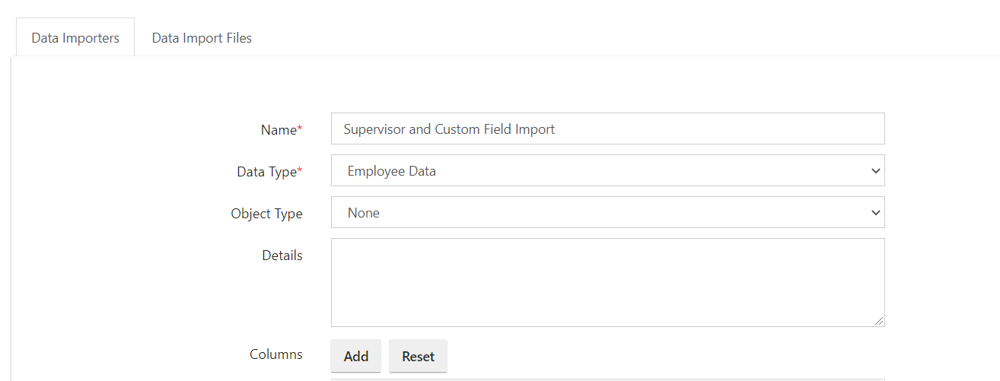

3. Each importer should have one ID column. For employees, the id column should be employee\_id. Here is how you can add this unique id column.

4. Edit the newly created data importer and add a new column named employee\_id. 

The **Type** of the column should be **Reference**. We call this type of column a reference type column because it depends on another row in a different or same entity. When you select the Type as Reference, select the ideal options for Depends On and Depends On Field as the below screenshot.

Note that the value "is ID field" is Yes.

**Sample Value** should be a value shown in the sample download. For this column, you can set the sample value as EMP050.

Under the **Help Text** enter a small description about the column.

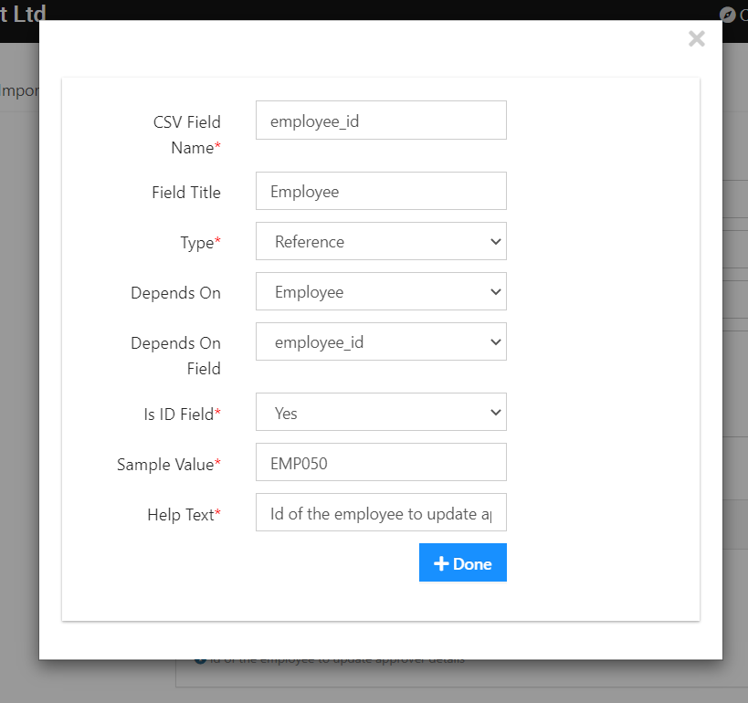

5. Then add the column for Supervisor. This column is also a Reference column.

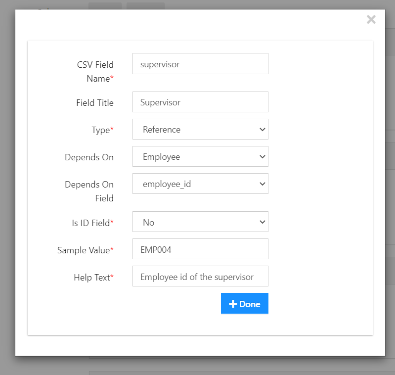

Note that we have set "Is Id Field" as No.

Click on the Save button once you add all the columns you require.

### How to create a custom field for Contract End Date

Navigate to `Admin -> Custom Fields -> Add New`

Add a custom field name as Contract End Date

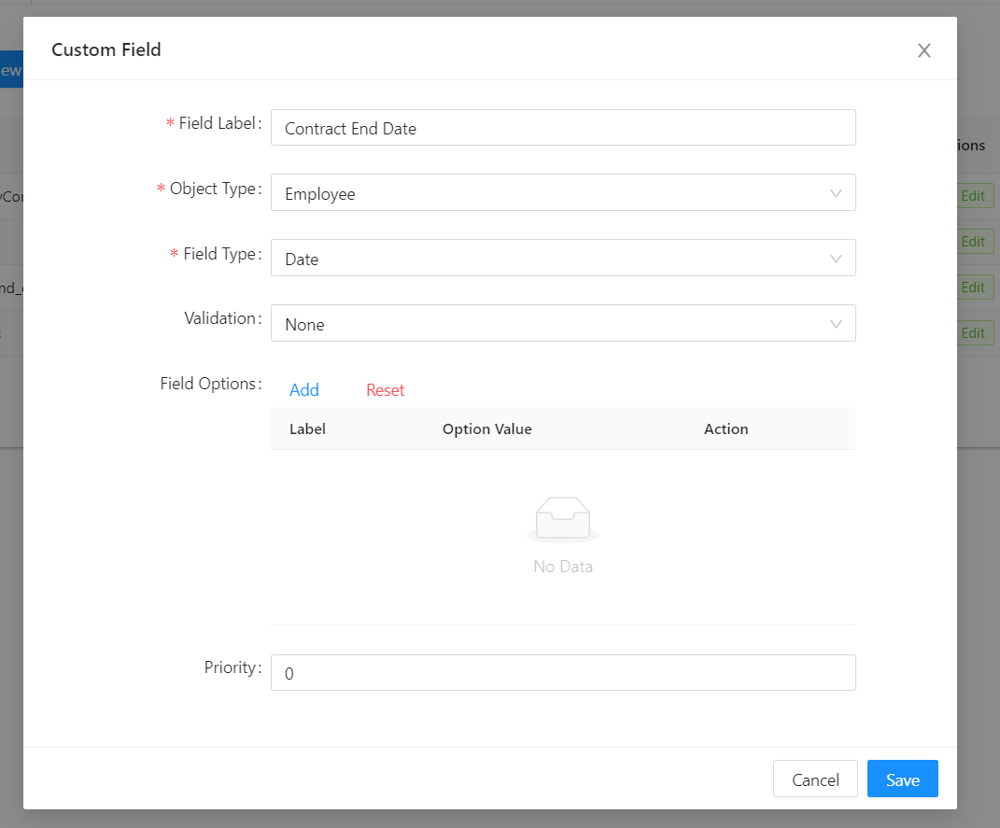

Now you can add a column to the existing Employee Data Importer for importing data for "Contract End Date"

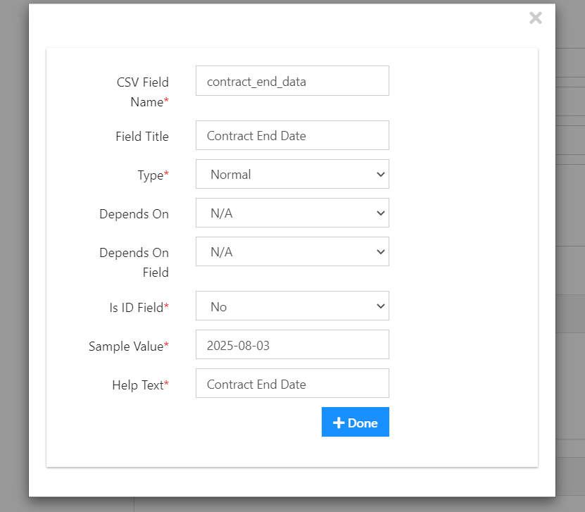

6. Now you can create the CSV file to import the superviors and contract end date for employees. In the CSV file, there should be three columns defined for Employee Id, Supervisors and Contract End Date. The supervisor field should hold the employee\_id of the supervisor.

Download the file already created CSV file for this step from [here](https://s3.amazonaws.com/icehrm/images/blog-files/employee_supervisors.csv)

7. Then go to the Data Import Files tab. Click on New to upload a new Data Import File. **Name** the File and select the **Employee Data Import** option for the **Data Import Definitions**. Then upload the CSV file and click on Save.

9. Then process the file

## **Creating a Data Importer for Updating Approvers**

As explained above, first we need to create columns for the Approvers. 

1. To do this, Navigate to System -&gt; Data -&gt; Data Importers. Then click on the Add New option under the Data Importers. Name the Date Importer and then Select Employee Data as the Data Type.

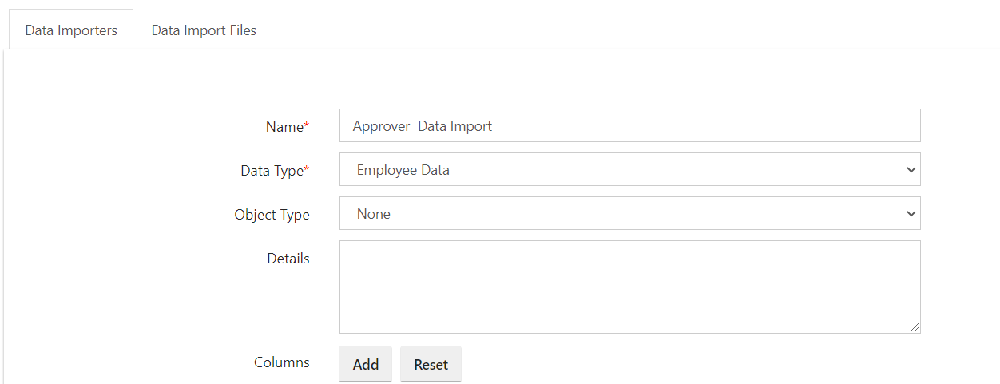

2.  Click on the Add button to create columns. The first column should be employee\_id. 

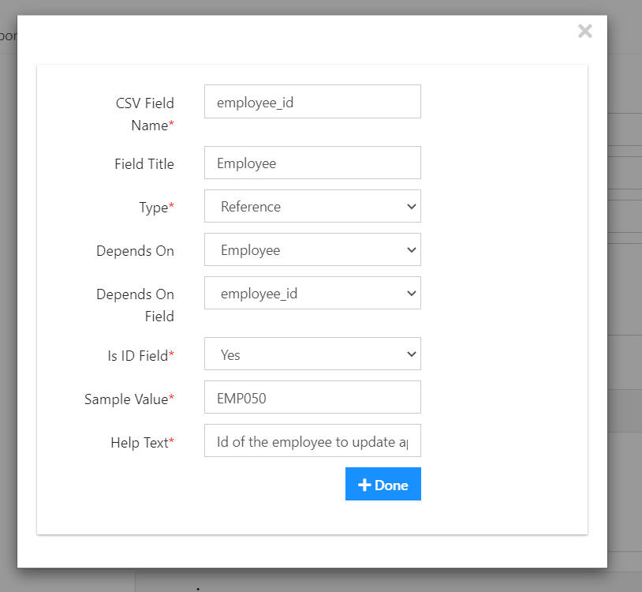

3. Then create columns for the Approvers. Click on the Add button to create more columns. Name the Column ID as "approver1".

4. Then select the Type as Reference. Select Employee as the Depends On and employee\_id as the Depends on Field. Set the Value as No to "Is Id Field".

6. Repeat the same steps for other levels of approvers as well. And click on the Save button to save the changes. 

7. Then go to the Data Import Files tab. Click on New to create a new Data Import File. Name the File accordingly and Select the Employee Data Import option for the Data Import Definitions. Then upload the CSV file and click on Save.

9. Then click on the Process button. 

## Creating a User Data Importer

Using [IceHrm](https://icehrm.com) latest features now you can automate the process of creating users. You can do this by creating a data importer.

Login as Admin and Navigate to **System -&gt; Data Importers**

Create a new Data Importer named "**User Data Importer**" and Data Type should be "**UserDataImporter**"

_Each importer should have one ID column._ For this one ID column should be UserName. Here is how you can add this unique id column.

Click on the **Add** button in front of the **Columns** option. You need to add a column to each of these fields in order to create a user account.

1. User Name
2. Email
3. User Level
4. Employee

Let's start with the first column, **User Name**.

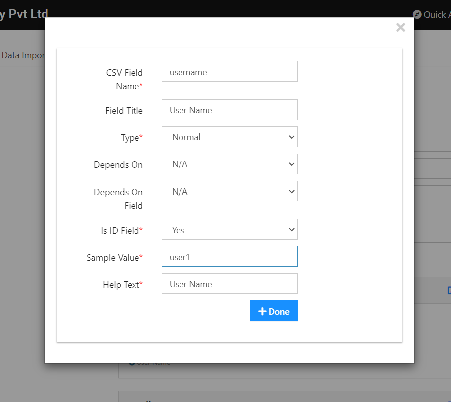

Note that the value "**is ID field**" is **Yes**. **Sample Value** should be a value shown in the sample download. For this column, you can set the sample value as user1.

Under the **Help Text** enter a small description about the column.

The second Column is the **Email** column.

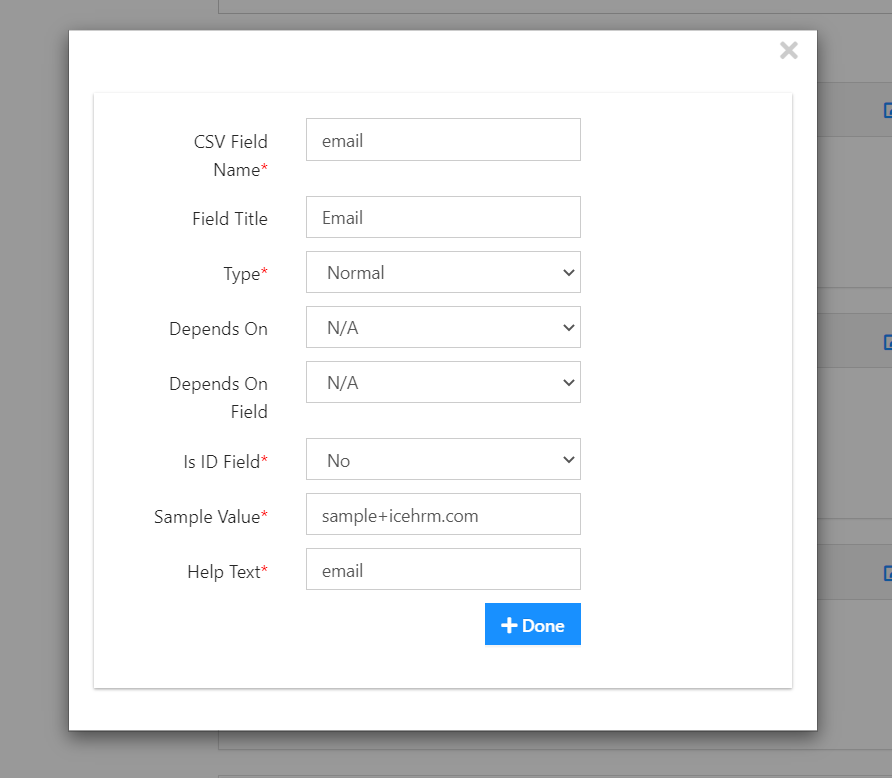

Note that the value "**is ID field**" is **No**. **Sample Value** can be an example email address.

The third column is the **User Level** column.

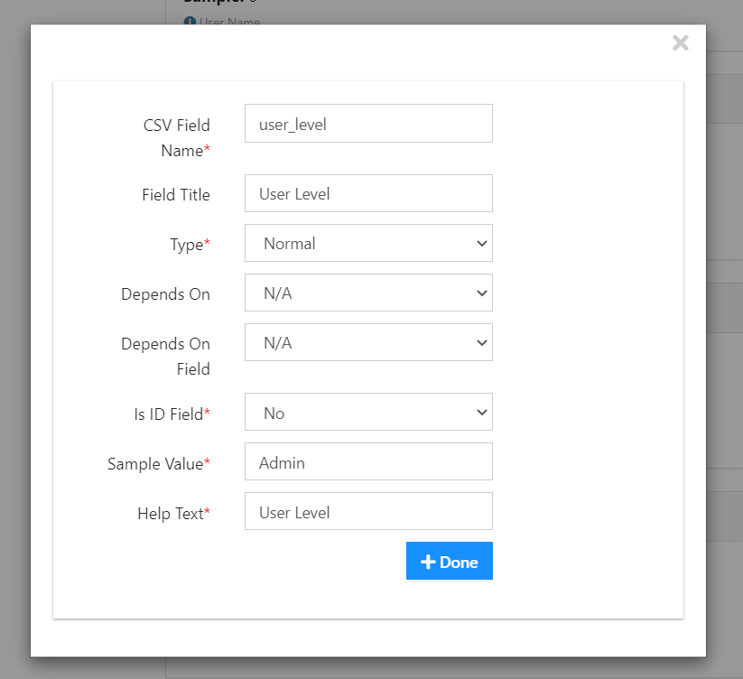

Note that the value "**is ID field**" is **No**. **Sample Value** can be one of the User Levels.

The fourth column is the name of the **Employee**.

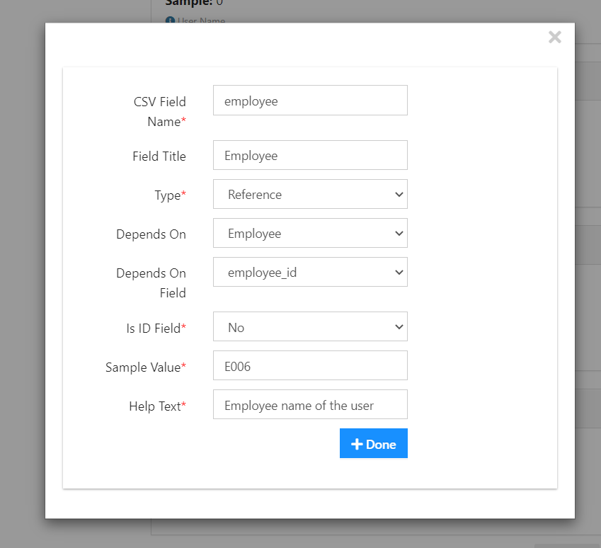

Note the **Type** of the column should be **Reference**.

Then Select **Employee** to the **Depends On** option and **employee\_id** as the **Depends on Field**.

_**When you create your csv file, under the employee column, you need to enter the employee\_id data so the IceHrm find the matching employee and update the user.**_

Now you can create the CSV file to import User Data. In the CSV file, there should be four columns defined for **username, email, user\_level and employee**. As mentioned above the employee column should hold the employee\_id of each employee.

Download the sample file already created for this step from [here](https://docs.google.com/spreadsheets/d/1BxGYzw5PybD4PmEvlEqo_paC0Hqxzr64hhJBj3qztYg/edit?usp=sharing). Download it as a csv file when you import it to IceHrm.

## Finding Problems When a Data Import Failed

If you have failed to import a file to IceHrm, you can find out what went wrong. You will get an error message once you click on the process button if you're data file is wrong. 

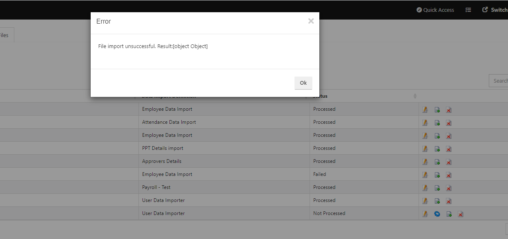

Click on the OK button and then click on the Edit button to check the error.

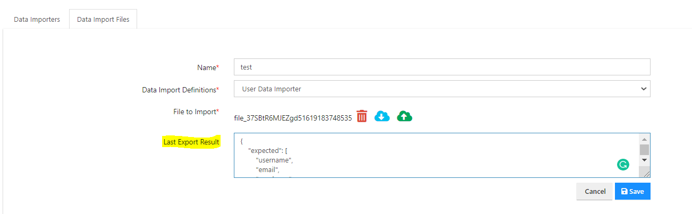

You can see the error report under the Last Export Result. If you scroll down you can see what's the difference between the expected and actual results. 

