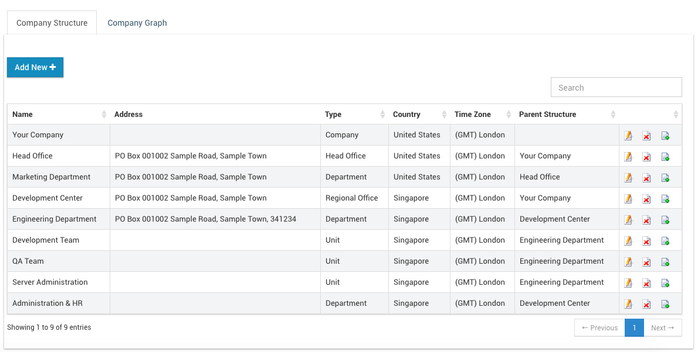
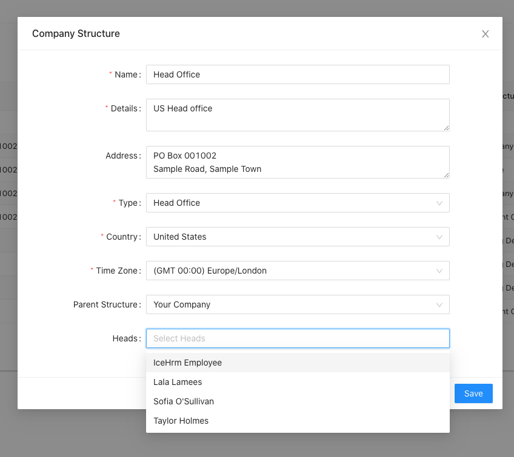
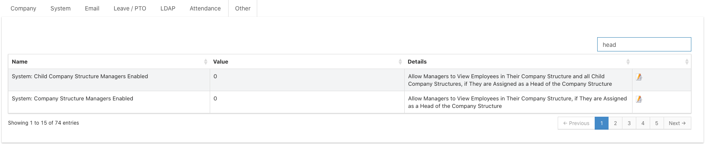
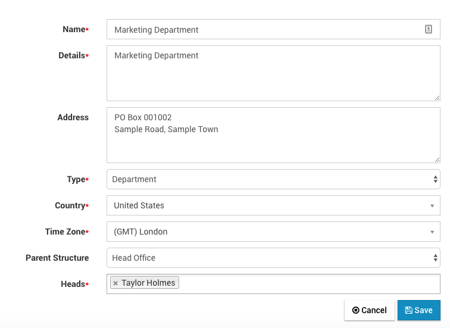
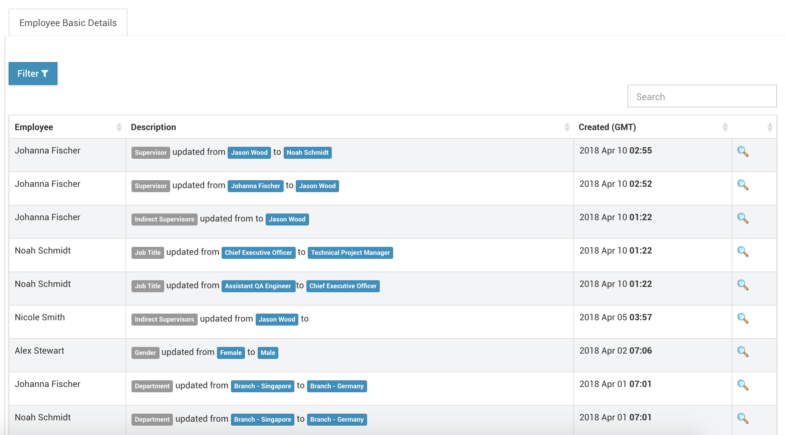

# Employee Management

## Employee Management

Employees module is used to list, edit, add and search employees in your company. You can use the search box to search employees by ID, name or department. Also, you can use the filter button to filter employees by job title, department or supervisor.

Each employee is attached to a company structure. A company structure can be a Group, Company, Branch or Department. Before adding employees you should first define your company structures

### Company structure

Company structure module allows you to define the structure of your company. Let you create parent structure of the company, branches, departments and other company units.

Also it provides a graphical overview of how each of your company units are connected.

#### How to configure a manager as the head of the company structure and enable to view all employees

Let's take an example of a scenario to explain this situation. 

You have 2 offices in two countries.   
1 Office In UK - Secondary  
1 Office in USA -  Main

You need to configure that your USA HR manager to manage all employees and the UK HR manager can only view the UK  employees. To do this:

1. Go to the **Company Structure** under the **Admin module**
2. Then select the department you want to make changes
3.  Set a _head_ \(or a manager\) for a department, as shown in the below screenshot

4. Then go to the System -&gt; Settings and change the below settings to 1.

By Selecting your employee as head of a particular department, that employee will be able to view all employees under that department. You can appoint your USA HR manager to the Head office so the USA manager can see all employees. Then you can select the UK manager as the head of the UK office, so that manager will be able to see only the employees under the UK branch. 

#### Difference Between Users and Employees

A user is a person who can login to icehrm. It’s not required for admin users to have an employee attached but each non admin user must have an associated employee. Having an employee added in icehrm won’t allow the person to login to icehrm. You need to create a user with a Manager or Employee user level for that employee to be able to login to the system.

#### Adding Employees

Adding employees to ICE Hrm can only be done by the admin. The employee Id field should have a unique value. In order to complete adding an employee you need to provide job title, employment status and pay grade. These values can be defined in admin: Jobs module.

Once an employee is added to the system you will be asked to create a user for the newly added employee.

#### Switching Employees

One of the key features of ICE Hrm, is admins and managers ability to login as another employee. This feature can be used to apply leaves, add attendance records or update timesheets behalf of other employees.

To login as an employee you can use the switch user icon on employee list or the “Switch Employee” menu in top right hand corner.

#### Supervisors

1. Any employee can be the supervisor of another employee.
2. The supervisor of an Employee can be added by changing supervisor field of employee edit screen
3. If the employee is having **Admin** or **Manager** user level, they can view all their subordinates \(employees having the current employee as the supervisor\) via  **Employees =&gt; Employees**  menu

#### Indirect Supervisors

1. An employee can have multiple **Indirect Supervisors** which can be set via edit employee.
2. Indirect supervisors are useful when approving leave requests \(You can allow indirect supervisors to approve leave requests via **Settings -&gt; Leave/PTO**\)

#### Department Heads

1. One or more employees can be added to a department as a head of a department.
2. A department head can view and manage all employees under that department or substructures of this department give following settings under  **System -&gt; Settings -&gt; System** :
   * "System: Company Structure Managers Enabled"
   * "System: Child Company Structure Managers Enabled"
3. You can define  **Department Heads**  via **Admin -&gt; Company Structures**

#### Deleting Employee Data

In order to delete an employee, an admin should first click the **"Terminate Employee"** button on employee list. But we do not delete the employee data at this time. Instead employee is moved to **"Temporarily Deactivated Employees"** tab. When an employee is in **"Temporarily Deactivated Employees"** list, you can recover all the employee data with one click.

If you delete the employee from **"Temporarily Deactivated Employees"** tab, Employee profile will be moved to **"Terminated Employee Data"** tab. At this point you can not recover the employee, but still you can download all the data for employee in JSON format.

If you want to remove all the data related to the employee you can delete data in **"Terminated Employee Data"** also.

When billing for cloud-hosted installation, we consider count of active employees and employees under **"Temporarily Deactivated Employees"** tab. So if you do not want to get billed for an employee you need to delete the employee from **"Temporarily Deactivated Employees"** tab also.

#### Employee History

You can view details on how employee data changed over the time you can use `Employees => Employee History`

## Job Details Setup

_**\(Admin &gt; Job Details Setup\)**_

Here you can set up all the information related to job titles, pay grades and employment status in your company.

### Qualifications Setup

_**\(Admin &gt; Qualifications Setup\)**_

Skills, Educational Details, Certifications and Languages you define under qualifications setup module will be used by employees or admins to attach these qualifications to their profiles.

