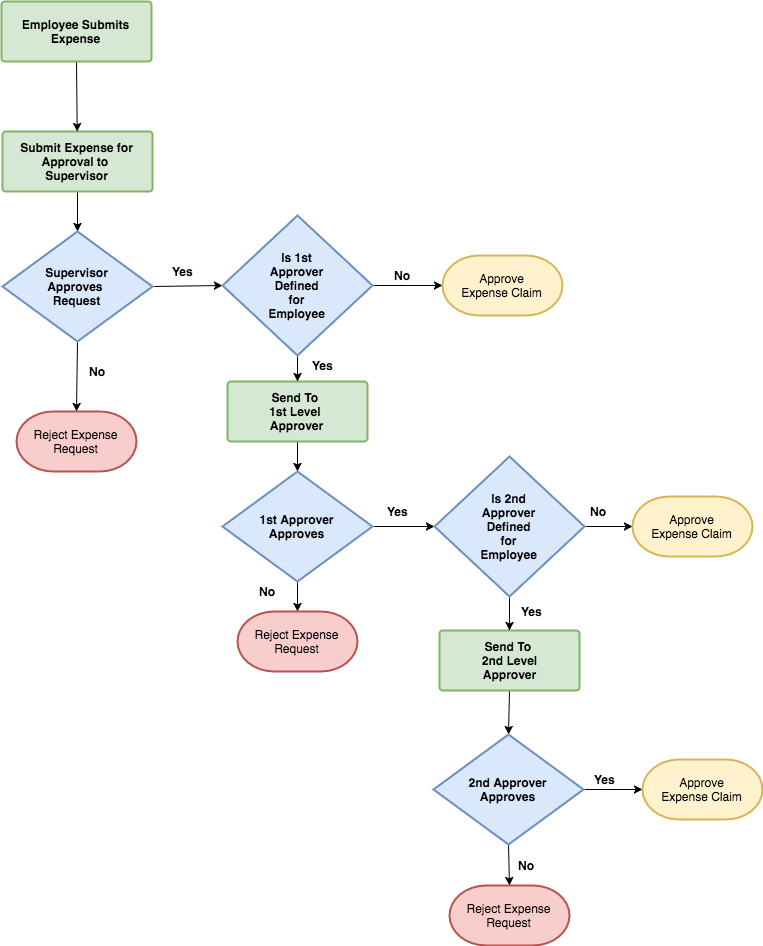

# Expense Management

### Configuring Expenses Module

Expense categories and payment methods can be configured under `Employees -> Expense Administration`. Also Managers can view and approve or reject subordinate expenses under the same module.

Admins can view and edit expenses from all employees.

### Adding Expenses

Employees can add expenses under `Finance -> Expenses`.

## Approval Process

You can define 1st, 2nd and 3rd level approvers for employees \(while editing an employee\). These approvers and employee's direct supervisor will be involved in approval process of most of the entities added by employees.

### Pre-Approving Expenses

If the Setting `Expense: Pre-Approve Expenses` is set to Yes, all new expenses will be approved automatically

### Reporting

Expense report can be downloaded under `Admin -> Reports` by specifying a date range.

