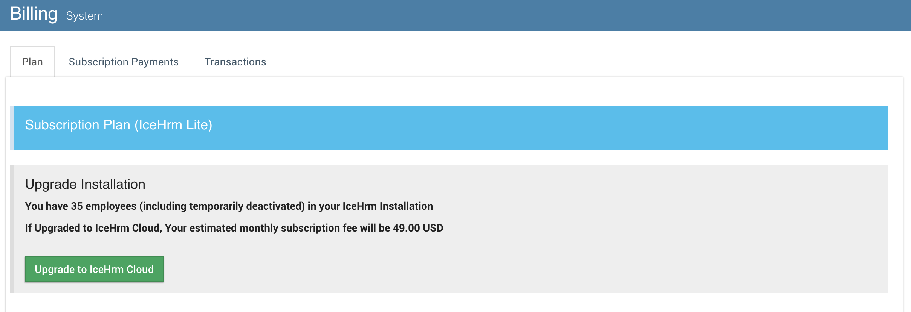

# FAQ

## Setup

### Not able to Verify Instance Key

If you are having trouble verifying the instance key please access your icehrm database via mysql console client or a graphical database manager like PHPMyAdmin and run following sql command

```sql
Update Settings set value = md5(value) where name = 'Instance : ID';
```

Then navigate to dashboard and try to verify your installation again

## Leave Management

### How to add a leave type only visible to limited number of employees

* Create a leave group \(Admin -&gt; Leave Settings -&gt; Leave Groups -&gt; Edit Leave Groups\)
* Add all the employees that should see the leave type to above group \(Admin -&gt; Leave Settings -&gt; Leave Groups -&gt; Leave Group Employees\)
* Create a leave type and set its leave group to newly created leave group
* Only the employees in step \(2\) will be able to see and apply for this leave type

## Pricing

### How is the pricing compare between IceHrm cloud and pro

Price for both depends on the number of employees you have. You can check the price for IceHrmPro here: [https://icehrm.com/buy-icehrm-modules](https://icehrm.com/buy-icehrm-modules). For an example, if you want to use IceHrmPro for 50 employees price will be 749 USD. This is a one time fee and you can optionally renew the license for 249 USD after the first year to keep receiving upgrades.

IceHrm cloud subscription starts with 9 USD per month for 10 employees. Cost per additional employees starts with 2 USD but the per employee fee goes down when your company is growing. You can get an estimate of monthly subscription by entering the number of employee you have here: [https://icehrm.com/cloud-hosting-charges](https://icehrm.com/cloud-hosting-charges)

### How to Update VAT ID

If your company is based in Germany you will be charged 19% Vat on your payment. If your company is based in another country in EU other than Germany you will be charged 19% unless you have provided your VAT ID.

You can update your Billing country and VAT ID under Settings -&gt; Company section

### How to Upgrade to IceHrm Cloud

When you create a new IceHrm hosted installation you will get to use a trail of IceHrm Cloud. After the 14 day free trail period you will be able to continue using your installation with IceHrm Lite, which has a limited number of features.

You can upgrade your installation, via billing module.



