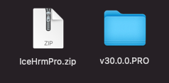
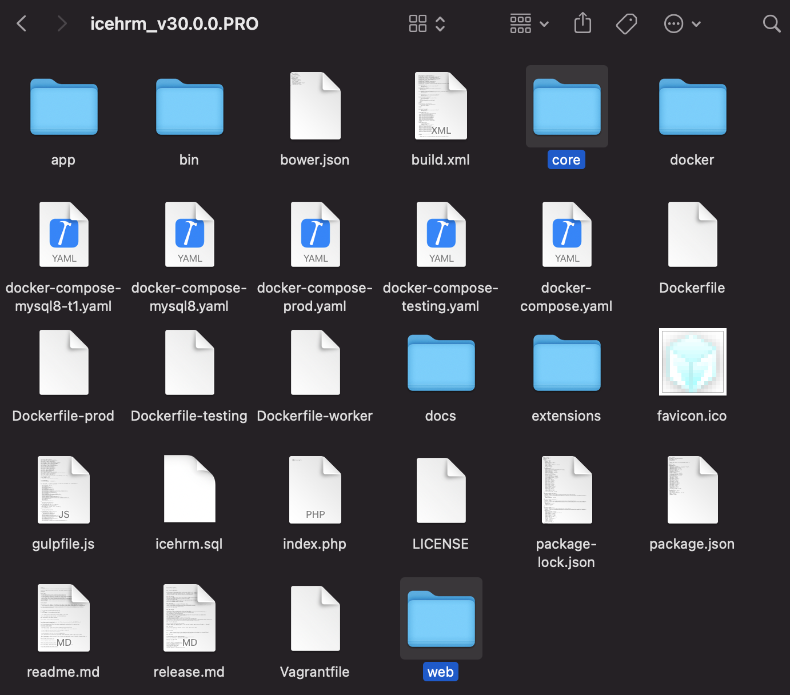
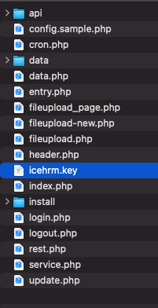

# Upgrade IceHrmPro

## Upgrade IceHrm Pro

* Download IceHrmPro release file
* Extract the latest IceHrmPro release \(zip\) file
* When you extract IceHrmPro.zip you should see a new directory created with IceHrm current version

* Go into "icehrm\_&lt;version&gt;" directory. Locate "core" and "web" directories, and replace the "web" and "core" directories in your new installation.

## Upgrade IceHrm Open Source to IceHrmPro


If you are already using icehrm open source, and purchased IceHrmPro. You can upgrade the installation without losing your data.


* Download IceHrmPro release file
* Extract the latest IceHrmPro release \(zip\) file
* When you extract IceHrmPro.zip you should see a new directory created with IceHrm current version

* Go into "icehrm\_&lt;version&gt;" directory. Locate "core" and "web" directories, and replace the "web" and "core" directories in your new installation.

* Copy icehrm.key file from the new release into your icehrm/app directory.

## 

