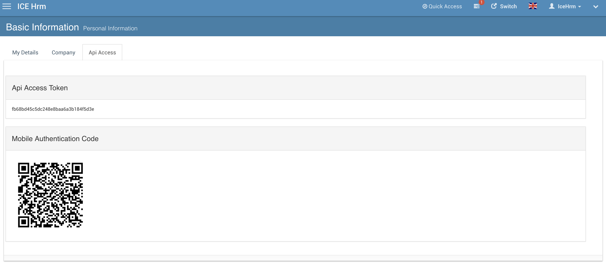

# Mobile App

## How to install the IceHrm mobile app? 

You can download IceHrm mobile app on App Store and Google Play. Currently the app support only attendance and Staff Directory

 

 

## How to log into the IceHrm Mobile App? 

In order to log in to IceHrm App, you need to have an IceHrm account. 

1. Log into your IceHrm account with your browser
2. Go to the Personal Information module 
3. Click on the Basic Information section 
4. Under the API Access tab, you will be able to find the Mobile Authentication Code
5. Scan the QR code using your mobile

In order to login to the app, you need an IceHrm account. It's supported on all Cloud installations. And IceHrmPro and open-source installations from v26.2

* First download and open IceHrm Mobile App
* Login to IceHrm Web with your browser
* Navigate to Personal Information -&gt; Basic Information -&gt; Api Access tab

  

* Scan the QR Code Displayed

