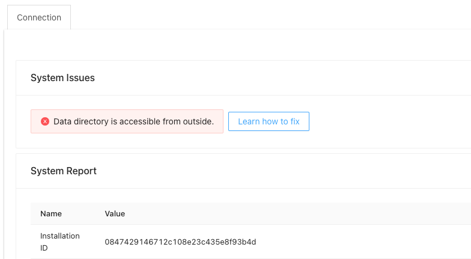

# Securing icehrm installation


Immediately upgrade your IceHrm installation to **v30.0.0**. This version is fixing a critical security issue related to file storage.


Visit **IceConnect** module, under **System =&gt; Ice Connect** and make sure no errors are displayed. If your icehrm is not secure it should display some errors such as this one:



This means your uploaded documents are not secure. For uploaded documents icehrm generates random names, but if the file name is known it can be retrived by anyone.

How to fix this:

**For Apache:** In the latest release we have added .htaccess file to data directory to prevent access. But if this error is still shown please consult your server admin to review the .htaccess file and make changes accordingly.

**For Nginx:** add the following location block in nginx virtual host file to prevent access to icehrm/app/data directory.

```text
location /app/data/ {
    deny all;
    return 404;
}
```

For a full example refer to \[nginx vhost file for development environment\]\([https://github.com/gamonoid/icehrm/blob/develop/deployment/vagrant/sites-available/default\#L25](https://github.com/gamonoid/icehrm/blob/develop/deployment/vagrant/sites-available/default#L25)\)

### Prevent Access to Core Directory

Allowing direct access to **icehrm/core** directoy can be a security risk to your installation. If you are using Nginx add the following location block to your vhost file to prevent this.

```text
location /core/ {
    deny all;
    return 404;
}
```

For a full example refer to \[nginx vhost file for development environment\]\([https://github.com/gamonoid/icehrm/blob/develop/deployment/vagrant/sites-available/default\#L30](https://github.com/gamonoid/icehrm/blob/develop/deployment/vagrant/sites-available/default#L30)\)

For Apache, we already have added the  \[.htaccess file\]\([https://github.com/gamonoid/icehrm/blob/develop/core/.htaccess](https://github.com/gamonoid/icehrm/blob/develop/core/.htaccess)\). But please try manually visiting a file inside the **icehrm/core** via the webserver to make sure the .htacees file is working on your server.


