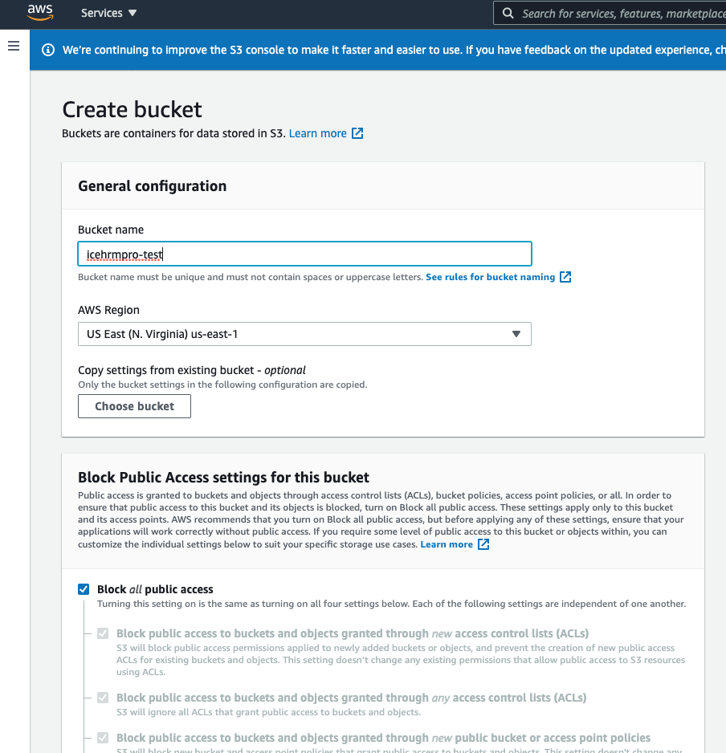
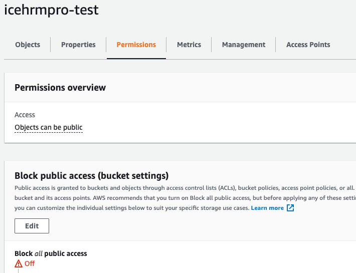
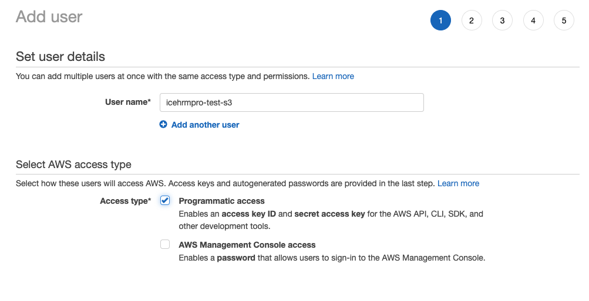
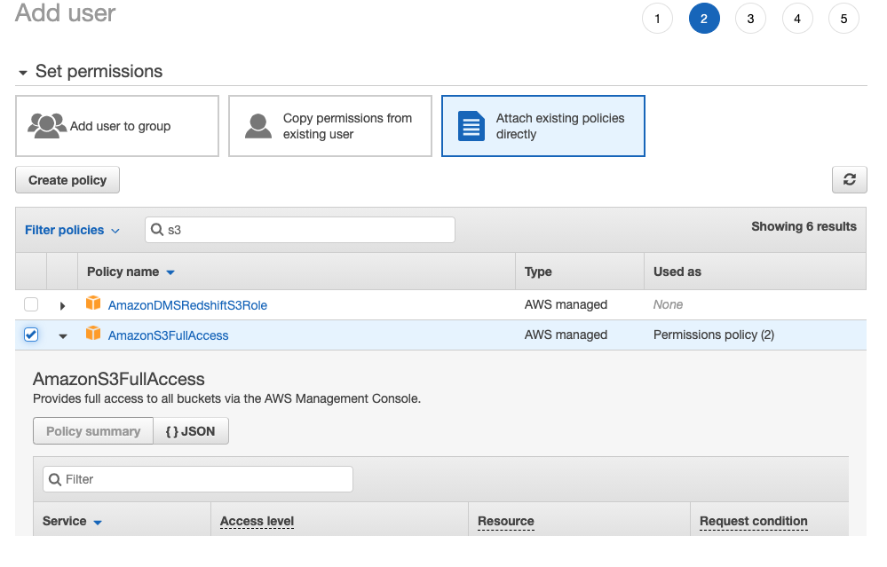
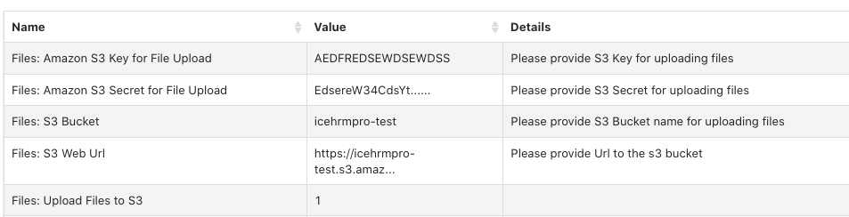

# AWS S3 File Storage

With IceHrm you can use Amazon S3 as your file system. In order to do that you need to first create an S3 bucket for icehrm. For this example, let's assume the name you are selecting for your s3 bucket is **icehrmpro-test.**

### **Configuration**

1. Goto AWS S3 console and create the bucket

2\. Make sure the bucket access is public. This doesn't mean the file stored here by IceHrm is public. A secure has is needed every time a file is accessed.

3\. Create an IAM user with access to S3. (You may use restrict permission for this user only to a selected bucket if needed)

4\. Update IceHrm Settings Accordingly Under System->Settings

5\. Set "**System: AWS Region**" setting under **System->Settings correctly**.

### Testing

* Update a file for an employee via the documents module
* Check if you can download the file and make sure it's being downloaded via S3 URL
* If successful upload all the files in icehrm/app/data to s3 bucket and make sure file permissions are not set to public
* Try downloading an old file


Test and make sure your S3 files can not be accessed publicly.

