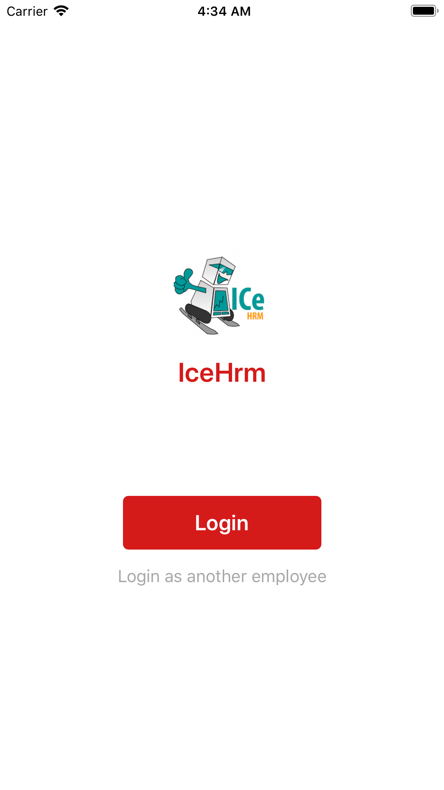
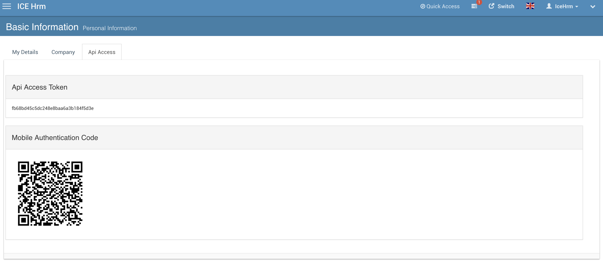

# IceHrm Mobile Apps

You can download IceHrm mobile app on App Store and Google Play. Currently the app support only attendance and Staff Directory

## Login to IceHrm

In order to login to the app you need an IceHrm account. It's supported on all Cloud installations. And IceHrmPro and
open source installations from v26.2 

- First download and open IceHrm Mobile App
- Login to IceHrm Web with your browser
- Navigate to Personal Information -> Basic Information -> Api Access tab

- Scan the QR Code Displayed
