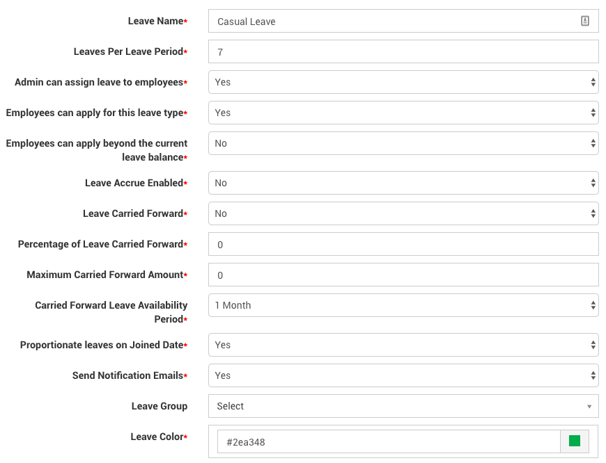

# Company Leave Policy

## Introduction

Icehrm has tools to implement complex leave policies. So most of the companies are covered by it. For an example, due to government regulations of some European countries, the leave policies of companies has become a bit too complicated, but still, IceHrm can handle those.

This section describes the process of implementing an advanced leave policy which involves multiple leave groups and rules in multiple countries.

## Example Leave Policy

Let's think of a company operating in **Germany** and **Singapore**.

### Setup Leave Periods

In IceHrm each Leave day is attached to a Leave Period. So It's important to configure the Leave Periods. Leave Periods are displayed under ** Admin => Leave Settings => Leave Periods **

If your company has not been using icehrm before, it is recommended to delete all previous leave periods and keep only the current leave period.

** After setting up leave types you can manually add all details about carried forward leave days and already taken leave days using **Paid Time off** tab under **Leave Settings\*\*

### Leave Types in Singapore

Singapore company has three leave types.

#### Annual Leave

Every employee gets 14 days off per year. Remaining leave days can be carried forward indefinitely. For an example, if you were an employee since 2016 and took 10, 13 annual leave days respectively in 2016 and 2017, by 2018 you will have 19 annual leave days. 14 from 2018 and 5 days from previous years.

**Creating Leave Type for Annual Leave**

1. Login to IceHrm installation as an admin
2. Goto Admin -> Leave Settings
3. If you have created a fresh installation, delete existing leave types
4. Add a new leave type (name it as "Annual Leave")
5. Set _Leaves per Leave Period_ to 14
6. Set _Admin can assign leave to employees_ to Yes
7. Set _Employees can apply for this leave type_ to Yes
8. Set _Leave Carried Forward_ to Yes (As you need to carry forward remaining leave to next period)
9. Set _Percentage of Leave Carried Forward_ to 100 as you need to carry forward 100% of the remaining leave
10. Set _Maximum Carried Forward Amount_ to 0. Setting this to 0 will remove the limitation on carried forward leave days
11. Set _Carried Forward Leave Availability Period_ to _No Limit_. This will allow employees to carry forward _Annual Leave_ indefinitely
12. Set _Send Notification Emails_ to Yes. This will send out emails to approvers when a leave application is submitted
13. Select a _Leave Color_. This will be used to show leave details on leave calendar

#### Casual Leave

Each employee gets 7 days per year. Can not be carried forward

**Creating Leave Type for Casual Leave**

1. Add a new leave type for Casual Leave. The settings can be seen in the screenshot
2. Note that you should set _Leave Carried Forward_ to No

#### Maternity Leave

A working mother can take this leave 4 weeks before expected date of childbirth. Up to 48 leave days can be taken.

**Creating Leave Type for Maternity Leave**

1. Add a new leave type for Maternity Leave. The settings can be seen in the screenshot
2. For maternity leave, we do not need to enable accrue or carry forward.

#### Initial Test for Leave Settings

**Adding test employees**

For testing, we have added 5 employees.

As you can see some employees are based in Singapore and some are based in Germany.

**Initial Test for Leave Balances**

For testing the leave balance of each of them you can use the _Employee Leave Entitlement_ report. Go to _Admin Reports_ => _Reports_ to generate it.

Here all the employees are entitled to have all the leave types. Also, the leave numbers are as expected.

#### Adding Leave Types by Country

As you can see there is a problem with above leave entitlement report. The leave types we have defined are entitled to all the employees, even the ones based in Germany.

In order to, correct the problem, you need to use leave groups. Leave groups is a way to allow only certain employees the ability to apply for certain types of leave.

**Defining a Leave Group for Singapore**

Define a Leave Group for Singapore under _Admin => Leave Settings => Leave Groups => Edit Leave Groups_

Then add Singapore employees to this group under _Admin => Leave Settings => Leave Groups => Leave Group Employees_

As the next step set _Leave Group_ of the _Annual Leave_ to _Singapore_

Repeat this for other two Leave Types as well.

**Second Test for Leave Balances**

Now generate the _Employee Leave Entitlement_ report again. Now you will see that only Singapore based employees are entitled for Leave Types we just created.

#### Allow Maternity Leave only to Working Mothers

We still have a problem with above leave entitlement for Singapore. Only working mothers should be allowed to apply for Maternity Leave. This can be achieved by adding a new _Leave Group_.

1. Add a Leave Group Named "Singapore Working Mothers"

1. Add Nicole Smith to Leave Group "Singapore Working Mothers"

1. Go to Leave Type tab and change the Leave Group for _Maternity Leave_ to "Singapore Working Mothers"

1. Under _Employees => Employees_ switch to _Nicole Smith_. This will let you use the application as _Nicole Smith_

1. Open _Leave => Leave Management => Leave Entitlement_. This will show all three leave types

#### Third Test for Leave Balances

Now generate the _Employee Leave Entitlement_ report again. Now you will see that Nicole Smith is entitled to Maternity Leave. This is because of _Maternity Leave_ is under Leave Group _Singapore Working Mothers_ and only _Nicole Smith_ is in that Leave Group.

### Leave Types in Germany

The German company has three leave types.

#### Vacation

Every employee gets 25 days off per year. Remaining leave days can be carried forward for three months.

If the employee has been working for more than 2 years. They get 1 additional vacation day.

If the employee has been working for more than 3 years. They get another 1 additional vacation day.

If the employee has been working for more than 4 years. They get another 2 additional vacation days.

For an example of your 5th year in the company, you get 29 vacation days.

**Creating Leave Type for Vacation**

1. Create a Leave Group for Germany

1. Add all other employees to this Leave Group

1. Create a Leave Type named Vacation. Set leave carry forward enable and allow carry forward to 3 months. Also, make sure to set the _Leave Group_ to _**Germany**_

#### Sick Leave

Employees are entitled to Sick Leave given without a limitation. We will set a limit of 14 days per year for **Sick Leave** but allow employees to apply it without a restriction by setting **Employees can apply beyond the current leave balance** to **Yes**.

**Creating Leave Type for Sick Leave**

#### Forth Test for Leave Balances

Now generate the _Employee Leave Entitlement_ report again. Only employees in Germany should be entitled to Vacation and Sick Leave.

_**But still, we have a problem with Vacation Leave. How to apply different amounts of leave to employees based on years of experience.**_

**This can be implemented using Leave Rules.**

#### Creating Leave Rules for Vacations

Leave rules are a way to alter Leave Types for individual or specific groups of employees. For an example, you can increase the number of leave days only for employees having permanent work contracts by adding a Leave Rule.

**Vacation Leave Rule (Employees having 2 Years of Experience)**

1. Goto **Admin => Leave Settings => Leave Rules **
2. Create a new Leave Rule for Leave Type **Vacation**. Set the **Required Experience (Days)** to 730 which is 2 years and Number of Leave Days to 27, as we need to give 2 additional leave day to employees who worked more than 2 years. _\*_ This Leave Rule will be applied to the employees having more than 730 days between the joined date listed on profile and the start date of the current leave period.

1. In order to create the Leave Rule for 3 years, copy the 2-year leave rule and change **Required Experience (Days)** to **1095 (3 Years)** and Number of Leave Days to 28
2. In order to create the Leave Rule for 4 years, copy the 3-year leave rule and change **Required Experience (Days)** to **1460 (4 Years)** and Number of Leave Days to 30

#### Fifth Test for Leave Balances

Now generate the _Employee Leave Entitlement_ report again.

* **Jason Wood** has 30 days of Vacation as he joined in Aug 2005
* **Noah Schmidt** has 25 days of vacation. He joined in March 2016. But there is not more than 730 days between joined date and 1st day of the current leave period which is 1st of Jan 2018
* **Johanna Fischer** has 27 leave days as she is eligible for 2-Year vacation leave rule. She joined in May 2015 and there are more than 730 days and less than 1095 days from the joined date to 1st of Jan 2018

### Adding Information about previously taken Leave Days

Even though you just configured your company leave policy in IceHrm, your employees might have been applying for leaves even before.

Assume you migrated to IceHrm in March 2018. In this case, you can use Paid time off tab to add already taken leave details for employees. For an example assume **Jason Wood** has already taken 5 Vacation Days off. And **Johanna Fischer** still have 6 Vacation days carried forward from the previous year.

** In order to implement this you can add a negative paid time off for Jason Wood positive paid time off for Johanna Fischer. **

1. Visit ** Admin => Leave Settings => Paid Time off **
2. Add -5 Vacation days for **Jason Wood**

1. Add 6 Vacation days for **Johanna Fischer**

#### Sixth Test for Leave Balances

Now generate the _Employee Leave Entitlement_ report again.

As you can see **Jason Wood's** Vacation days are reduced from 30 to 25 and **Johanna Fischer's** Vacation days are increased from 27 to 33.

### Adding compensated Leave days

Assume **Johanna Fischer** worked 2 additional Saturdays to get your urgent project released. So you can compensate her with two additional Vacation days using Paid time off.

### Making Saturday a Half Day in Singapore

Currently, both offices only work from Monday to Friday. Let's say you want to make Singapore employees work half a day on Saturday also.

1. Visit ** Admin => Leave Settings => Work Week **
2. Add a work day for Saturday in Singapore

** Note that this will be applied to employees having **Country set to Singapore\*\* on there profile.

### Few Last Notes

1. When an employee applied for a Leave his/her Leave Balance will be updated only when the leave is approved
2. Until the Leave is approved employee has the ability to delete it.
3. After the approval, the employee can cancel the Leave. But the cancellation request will be sent to the supervisor and only after the cancellation request is approved, the leave balance will be updated.
4. Leave days will be carried forward only from Leave Period defined. For an example, if you have leave periods defined for 2017 and 2018, leave days will be carried forward only from 2017 to 2108. Leave days could have been carried forward from 2016 will be ignored.
5. After configuring Leave Types if you are seeing wired numbers as balances first check whether you have previous leave periods defined which are actually not required. When you enable leave carry forwarding and there is a previous leave period defined, current leave period will get leave days carried forward from previous leave period.
6. All the employee leave requests should be approved by the supervisor or an admin. An admin can approve any leave request.
