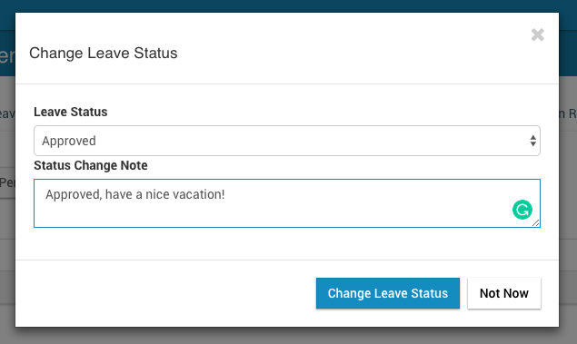

# Leave Requests and Approval

This section explains the process of an employee applying for a Leave and supervisors, approvers or admins approving or rejecting the leave request.

## Applying for Leave

Any employee can apply for a leave via ** Leave => Leave Management ** menu

When applying for a leave, the employee can select the period to apply for the leave and then in the next step they can select what type of leave they want to apply (full-day / half-day or partial)

When the leave application is submitted, the employee and the supervisor of the employee will receive email notifications

The supervisor of the employee can view leave request via ** Leave => Leave Management => Subordinate Leave ** tab (Indirect supervisors also will be able to see/approve leave requests if the setting "Leave: Allow Indirect Admins to Approve" is set to "1")

The supervisor can view leave request details and then approve or reject the request

When the leave request is approved or rejected, an email is sent to the employee with the result

Leave entitlement of the employee is updated accordingly. Amount of leave days is 1.875 because it has a full day (1), half-day (0.5) and a three-hour leave (3/8). 1 + 0.5 + 3/8 = 1.875

### Canceling Leave Requests

1. If a leave request is not approved, it can be just cancelled by the employee
2. For approved leave requests, the employee needs to send a cancellation request (via Leave Management, Approved Leave tab). This cancellation request will be sent to the supervisor and only when the supervisor approve the cancellation request the employee's leave entitlement will be updated

## Manage Leave Requests as an Admin

An admin has access to all the employee leave requests via ** Admin => Leave Settings => Employee Leave List **. The filter button can be used to filter leave requests from older leave periods also. Admin has the right to approve/reject any leave request

