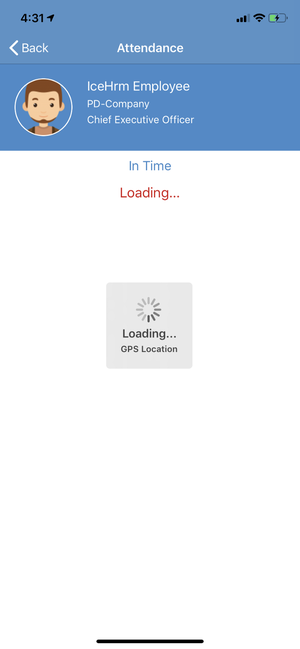

# Attendance Tracking

Installing an IceHrm attendance tracking application on your phone helps you keep control of your work. It is particularly useful for employees who work at a site that does not have access to IceHrm software, for those who leave the office to meet clients or for people who travel a lot. IceHrm mobile app support attendance and staff directory.

New IceHrm mobile app support to track the GPS location along with the attendance tracking.

The mobile version of the attendance tracking system is convenient, easy to access and you can take it with you wherever you go. All you need is your smartphone!

## How to enable GPS location when employees are marking attendance?

1. Log in to the admin account 
2. Go to the System Module 
3. Click on the Setting option 
4. Then go to the Attendance tab, you will be able to find Attendance: Request Attendance Location on Mobile and enable it to Yes
5. Update **System: Google Maps Api Key** , Under System-&gt;Settings-&gt;System tab \(instruction for obtaining a key [https://developers.google.com/maps/documentation/javascript/get-api-key](https://developers.google.com/maps/documentation/javascript/get-api-key)\)

## How to mark attendance using the IceHrm mobile App? 

1. Log in to the mobile App and click on the My Attendance option 
2. Click on the Plus mark, to Mark Attendance

3. Then Click on the Punch In option

## How the admin can view attendance details of the employees with location? 

1. Log in to the IceHrm Admin account 
2. Go to the Attendance Module on the Dashboard or you can go to the Employees Module and click on the Monitor Attendance option 
3. Go to the employee, you would like to see the location details and click on the Map icon to check the employee punch-in location IP, coordinates and an image of the map

