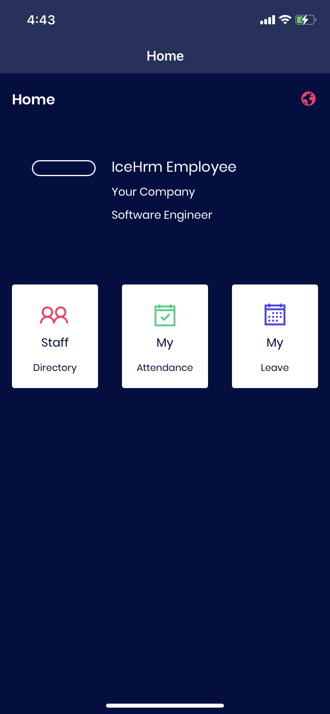
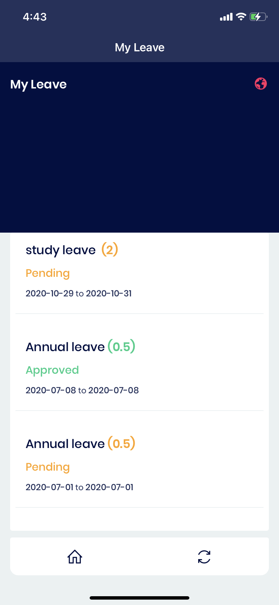

# My Leave

Let employees apply for days off, directly via the mobile. They can view the approved leaves, pending leaves and the dates of the leaves.

### How to check the leave status using the IceHrm mobile App?

1. Log in to the mobile app and click on the My Leave option
2. Employees can find out the status of their requested leaves as **Pending** Leaves, **Approved **Leaves or **Cancelled **Leaves. Also, the app shows the leave requested dates.&#x20;

