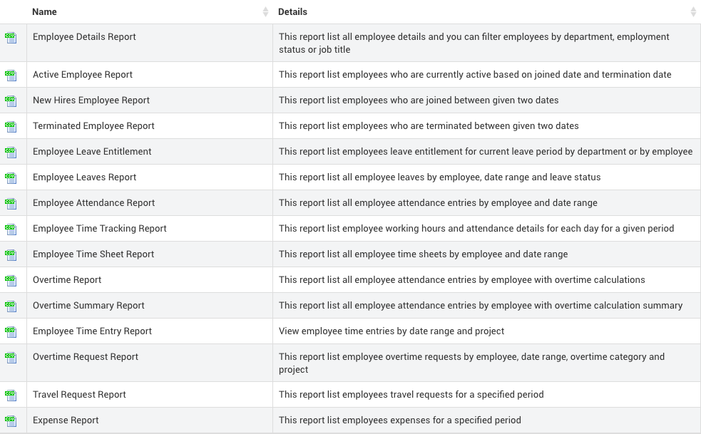
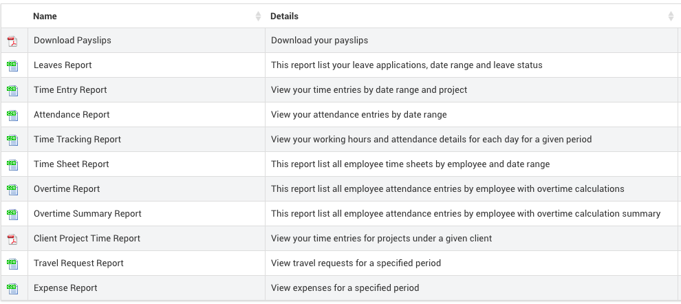

# Reporting

## Admin Reports

_**\(Admin Reports -&gt; Reports\)**_

IceHrm saves all the generated reports under report files section for future references. Admins are entitled to generate following reports.

## User Reports

_**\(User Reports -&gt; Reports\)**_

Following reports can be downloaded by employees

