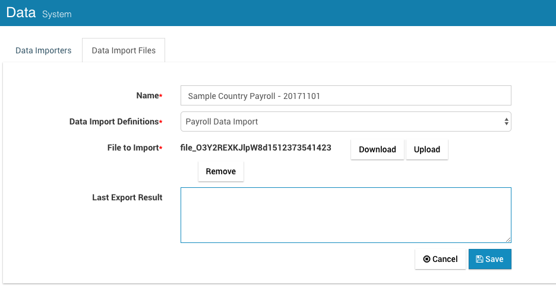

# Import - Export Payrolls

## Pre-defined Payrolls

IceHrm team has already created few sample payrolls which you can import and use to generate or study the payroll creation process.

### Download Payroll Files

* [Sample Payroll Setup](https://s3.amazonaws.com/icehrm/payroll/Sample-Country-Payroll.txt)
* [Sri Lanka Payroll Setup](https://s3.amazonaws.com/icehrm/payroll/SriLanka-Payroll.txt)
* [Ghana Payroll Setup](https://s3.amazonaws.com/icehrm/payroll/Ghana-Payroll.txt)

## Import Payrolls

* Goto System -&gt; Data module
* Select "Data Import Files" Tab
* Press Add New button

  

* Give a meaningful name and select "Payroll Data Import" as Data Import Definitions.
* Select the file you downloaded using above links
* Save
* From the list client on "Process" button

  

