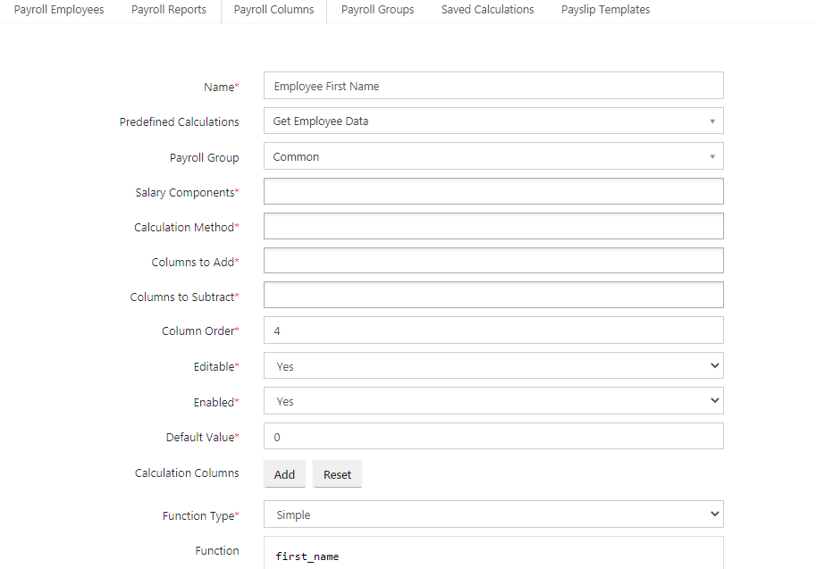

# Payroll Management

## Payroll Module Usage

You may use IceHrm to achieve following tasks:

* Store employee salary details with and group into salary components
* Calculate various deductions
* Include overtime payments into employee salary slips depending on number of hours
* Add salary components based on attendance sheets
* Allow employees to download payslips in PDF format

## Understanding Employee Salary and Salary Components

When paying salary to your employees you can have it divided into several components. When you create a new installation of IceHrm we pre-define some Salary components and group these salary components accordingly for your convenience.

If required you can add more. \(You may view/edit Salary Components under menu **Payroll =&gt; Salary**\)**Salary Component Types**Also in order to make it more easy to define taxes and other deductions on salary components we group these into Salary Component Types

## Defining Salary for Your Employees

You can add salary information for your employees under **Payroll =&gt; Salary =&gt; Employee Salary Components** tab.

This way you can define other salary components like allowances and hourly pay details.

## Creating Company Payroll

Company payroll is available under Payroll =&gt; Payroll menu. We have already added information for calculating payroll for Sri Lanka and Ghana. You can delete all these before starting to work on your payroll. But sometimes these data can come handy as an example for building your payroll.

## Adding a Calculation Group For Germany

First we should start with adding a **Calculation Group.** Go to Calculation Group Menu under Payroll and add a new calculation group. As an example we will be using Germany.

## Adding Payroll Columns

One of the best ways to decide which columns you need to have in your payroll report is to think of rows in your employee's payslip. Payroll report as a table which holds all your individual employee payslips in each row.

Since you have three salary components Basic, Car Allowance, and Hourly pay we can define the following payroll columns. \(For now, let's assume tax is 19% on total salary\).

Now here are the list of columns to show on payroll:

1. Basic Salary
2. Car Allowance
3. Hours Worked During Month
4. Hourly Pay
5. Payment For Hours Worked
6. Gross monthly salary
7. Deduction for Tax
8. Net Salary

So now we can start adding payroll columns. It's a good idea to prefix your payroll columns with its respective country code to make it easier to find.

### Adding Payroll Column for Basic Salary

Now you can go to the tab "Payroll Columns" and click on "Add".

As this column only depends on the Basic Salary component you can just select that salary component from the list. \(Note that in some cases you can add multiple salary components to same column\).

Also make sure you set the **enable to Yes** and **default value to 0.00**.

The **column order should be 1** because it should be the first column in your payroll report for Germany.

### Adding Payroll Column for Car Allowance

### Adding: Hours Worked During Month Column

There are employees who do not have a fixed salary but paid on hourly basis. Easiest way to handle these employees is to first create a column to get number of hours worked for the month using attendance. In order to do that you can use pre-defined calculations.

### Adding: Hourly Pay Column

We can take hourly pay from salary component and create this column as below:

### Adding: Payment For Hours Worked Column

Based on the previous column you have added, now you can create the hourly pay based column as shown below:

#### First create a new payroll column

#### Then, Client on "Add" button next to Calculation Columns

Here you are adding the previously defined **hours per month column as a parameter named X** and **hourly pay column as parameter Y,** so you can use it to do various calculations using these columns

Then under the **Function** field you can multiply these columns \(all other basic math expressions will work here\)

### Adding Gross Monthly Salary Column

Total monthly gross salary should be the sum of basic salary, car allowance and payment for total hours worked. This column can be created as shown below:

### Adding payroll Columns for Employee Details

When you need to indicate your employees details such as Employee Name, Employee ID, Bank Account Number, or Job Title, follow up the below steps:

This will be the same as you added the payroll columns before.

* First click on the **Add New** option under the **Payroll Column Tab**. 
* Add a **name** to the payroll column. Example: Employee First Name
* Then select the **Get Employee Data** option for the **Predefined Calculations** field. 
* Select the Payroll Group \(_You can keep this as Common because these details can be common for all of your payroll groups_ \)
* Give the **Column Order**.
* Set the Default Value to 0
* Then change the **Function Type** to **Simple** \(always select **simple** for these type of columns\)
* Under the **Function** field, you need to **add the field name** \(If you don't know how to add the field name, go to the **Employee Fields** tab under the **Admin m**odule. There, you can find the relevant field name\)

### Creating Calculation Method to Calculate 19% Tax

As you have seen you can do some calculations at column level. But things such as tax which are having different percentages and multiple slabs it's better to use calculation methods. Now you should go to the **Calculation Methods** tab and add a new calculation method.

You can create a calculation method based on a Salary component group \(type\), a Salary component or an Existing payroll column. In this case we use an existing payroll column.

Now click on add button on Calculation Process filed to define the actual calculation. According to our example for the full range of gross salary tax is 19%. So we don't need to define any ranges and can calculate the tax as follows.

Now we need to create a payroll column and add this calculation method to that column.

Please also play attention how we are assigning **column order** to each column.

### Add "Net Salary" column

Net Salary is Gross salary minus tax. So we create Net Salary column as shown below:

Now we have finished defining payroll columns. When you go to Payroll columns and search "DE - " you can see all the fields in German payroll.

## Create Payslip Template

As you have all the required payroll columns you can use these to create a payslip template. So we are going to create a new payslip template named German Payslip Template and add all the columns defined above. Goto Payslip Templates tab and create a new payslip.

A payslip template has can be created by adding following items:

1. Company Logo
2. Company Name
3. Text  \(For adding special messages to notifications to employees\)
4. Separators \(For separating sections on payslip\)
5. Payroll columns

## Create Payroll Report

Payroll Report is the unit used to combine all the payroll columns and calculate monthly payments for all the selected employees.

.Goto Payroll Reports tab and create a new Payroll Report.

When you create the payroll report it should be in **Draft** state. Only when it is processing completed it should go to **Completed** state.

Also you need to select all the payroll columns you defined earlier for german payroll here as shown above.

## Selecting Employees For Your Payroll Report

Above payroll is for monthly paid employees who are in German Payroll Calculation group. So you need to add some employees satisfying above requirements under **"Company Payroll"** tab.

As shown below we have added two employees to German payroll

## Configure Employee Salary Components

Since the payroll depends on employee salary components you should make sure all employee salary components are defined properly. You can do this by going to **Payroll -&gt; Salary** module and selecting **Employee Salary** tab.

As you can see here **IceHrm Employee** is getting a Basic and Allowance while **Lala Lamees** getting paid per hour. As we have configured our payroll report application now able to calculate the tax and other payroll columns properly.

Processing Payroll Report

Click on the blue color "Process" button on your payroll report under Payroll Report tab. This will show salaries of all the employees in your payroll. 

As you can see here IceHrm can now calculate your payroll.

After checking figures manually you can click on finalize button which will change the payroll report status to **Completed**.

## Downloading Payslips

Now your employee can login and download payslip for the payroll period 2017-08-01 to 2017-08-31.

Login as the employee and goto **User Reports -&gt; Reports** module.

And then download the Payslip from any completed payroll report

Payslip for IceHrm Employee will look like this:

## Generating Payroll for Next Month

Once you configure your payroll for initially, generating it for the second month can be done in few minutes.

### Clone a previous Payroll Report using **Copy button**

### Change Dates and set status to Draft

Then save the new Payroll Report and process and finalize it.

