# Create a sample Payroll

Company payroll is available under **Payroll =&gt; Payroll Reports** menu. We are going to create a sample payroll for India.

## Adding a Payroll Group For India

First we should start with adding a **Payroll Group.** Go to Payroll Group Menu under Payroll and add a new payroll group. As an example we will be using India.

## Adding Payroll Columns

One of the best ways to decide which columns you need to have in your payroll report is to think of rows in your employees' payslip.

Now here are the list of columns to show on the Indian payroll we are creating:

1. Basic Salary
2. Gross Salary
3. Basic Pay
4. Province
5. Professional Tax Slab
6. Employee Birthday
7. Employee Age
8. Income Tax
9. ESI Employee Contribution
10. PF Employee Contribution
11. Total Deductions
12. Other Allowances
13. ESI Employer Contribution
14. PF Employer Contribution
15. ESI Total
16. PF Total
17. Net Salary
18. Residential Area
19. HRA

So now we can start adding payroll columns. It's a good idea to prefix your payroll columns with its respective country code to make it easier to find.

### Adding Payroll Column for Basic Salary

Now you can go to the tab "Payroll Columns" and click on "Add".

As this column only depends on Basic Salary component you can just select that salary component from the list. \(Note that in some cases you can add multiple salary components to same column\).

Also make sure you set the **enable to Yes** and **default value to 0.00**.

The **column order should be 1** because it should be the first column in your payroll report for India.

### Adding Payroll Column for Gross Salary

### Adding Payroll Column for Basic Pay

Based on the previous column you have added, now you can create the basic pay column as shown below:

First create a new payroll column.Then, click on "Add" button next to Calculation Columns. Here you are adding the previously defined **gross salary column as a parameter named X**  so you can use it to do various calculations using these columns

### Adding Payroll Column for Province

We need to select Get Employee Data in predefined calculations and enter province_Name in the function field in order to get employee's province

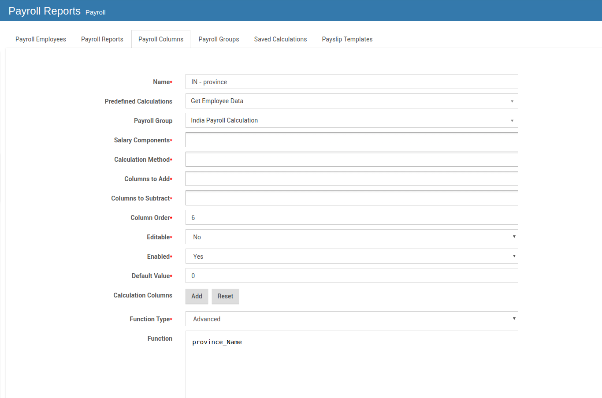

### Adding Payroll Column for Professional Tax Slab

This is calculated based on employee's state and basic pay. So you need to add those two calculation columns and write the function
to calculate PTS.

### Adding Payroll Column for Employee birthday

We need to select Get Employee Data in predefined calculations and enter birthday(Employees table column name) in the function field in order to get employee's birthday

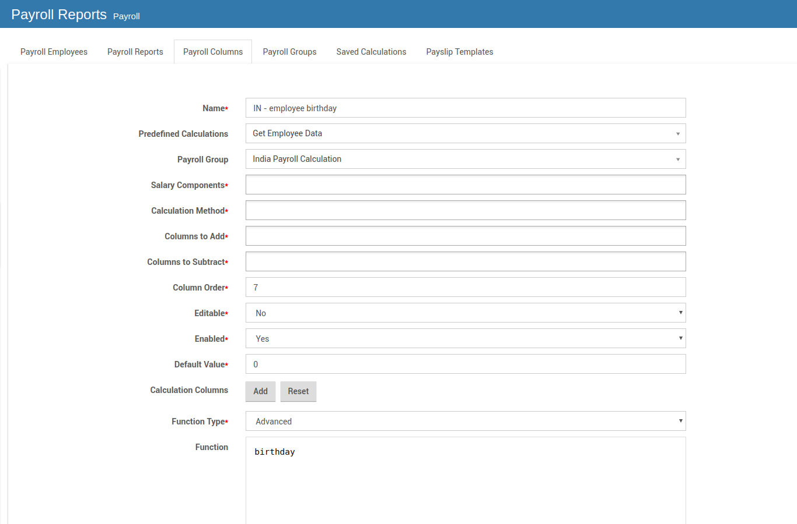

### Adding Payroll Column for Employee age

We need to get employee's birthday as a calculation column and write a javascript function to calculate age from that.

### Adding Payroll Column for Income Tax

We need to use employee's age and basic pay and write a function to calculate income tax.

### Adding Payroll Column for ESI employee contribution

As you have seen you can do some calculations at column level. But things such as tax which are having different percentages and multiple slabs it's better to use saved calculations. Now you should go to **Saved Calculations** tab and add a new saved calculation.

You can create a saved calculation based on a Salary component group \(type\), a Salary component or an Existing payroll column. In this case we use an existing payroll column.

Now click on add button on Calculation Process filed to define the actual calculation. According to our example for the full range of ESI is 0.75%. So we don't need to define any ranges and can calculate the tax as follows.

Now we need to create a payroll column and add this calculation method to that column.

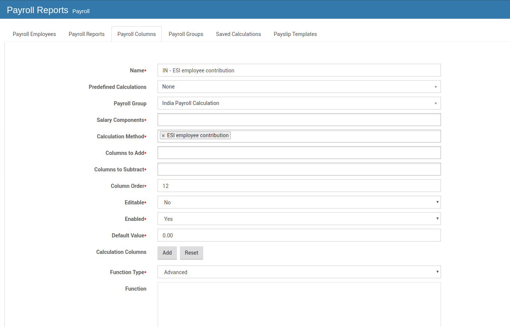

Please also play attention how we are assigning **column order** to each column.

### Adding Payroll Column for PF employee contribution

### Adding Payroll Column for Total Deductions

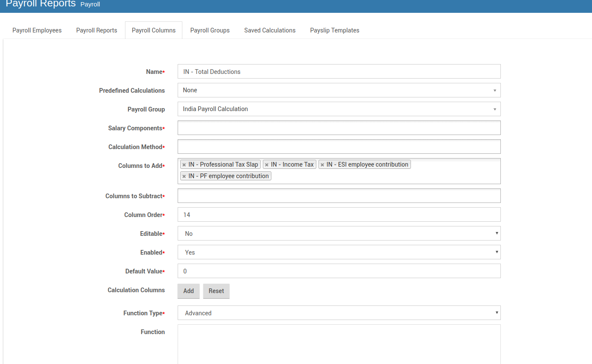

### Adding Payroll Column for Other Allowances

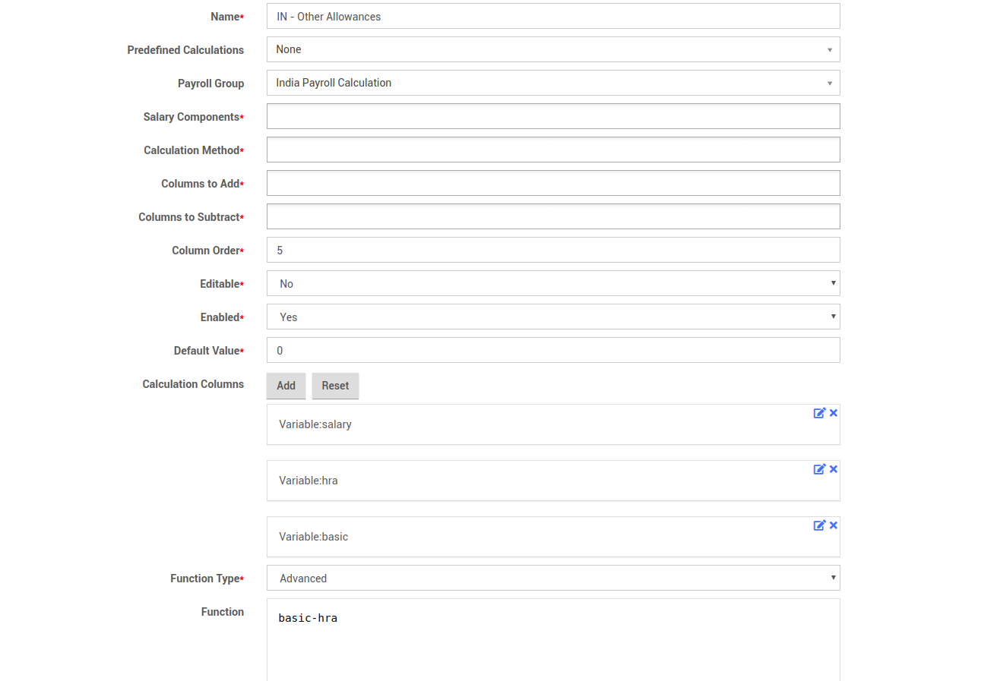

### Adding Payroll Column for ESI employer contribution

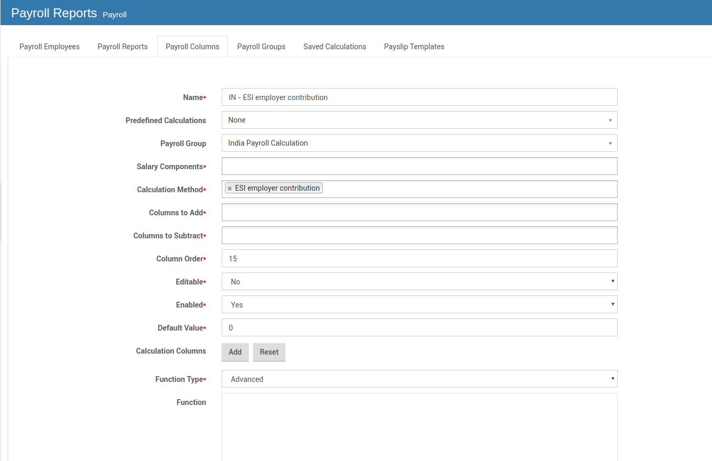

### Adding Payroll Column for PF employer contribution

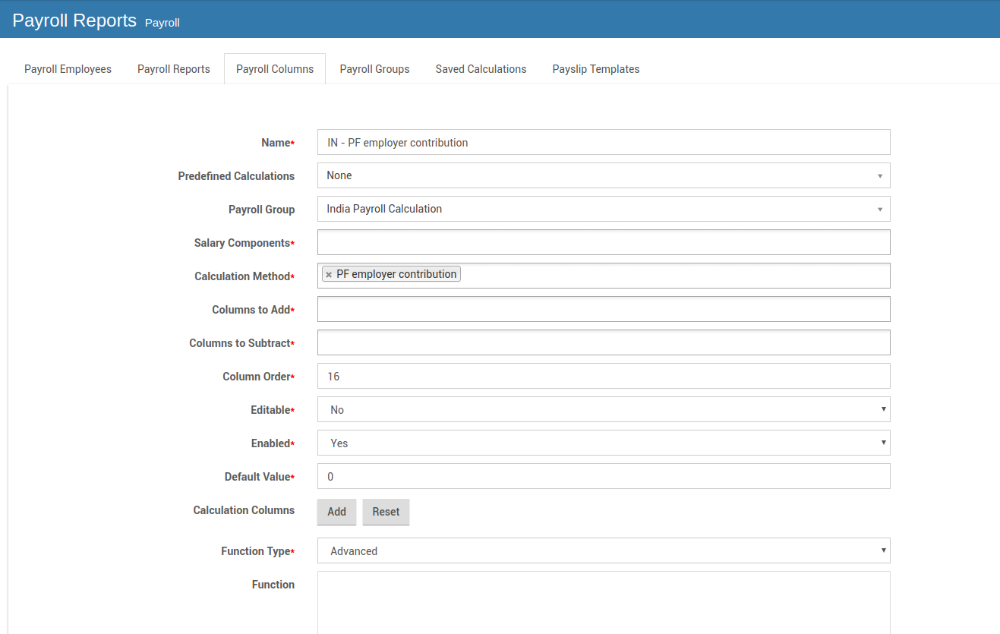

### Adding Payroll Column for ESI Total

### Adding Payroll Column for PF Total

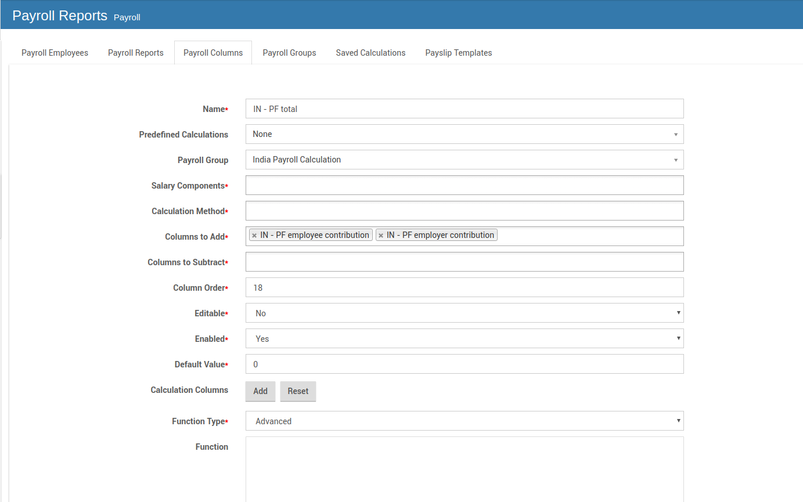

### Add Payroll Column for Residential Area

To calculate HRA we need to know whether an employee lives in a metro or non-metro area. As this is not a default employee data field, we need to add a custom field for residential area.

#### Add Custom Field for Residential Area

Go to **Admin => Employee Custom Fields**

Under **Employee Custom Fields** tan add a new custom field named residential_area

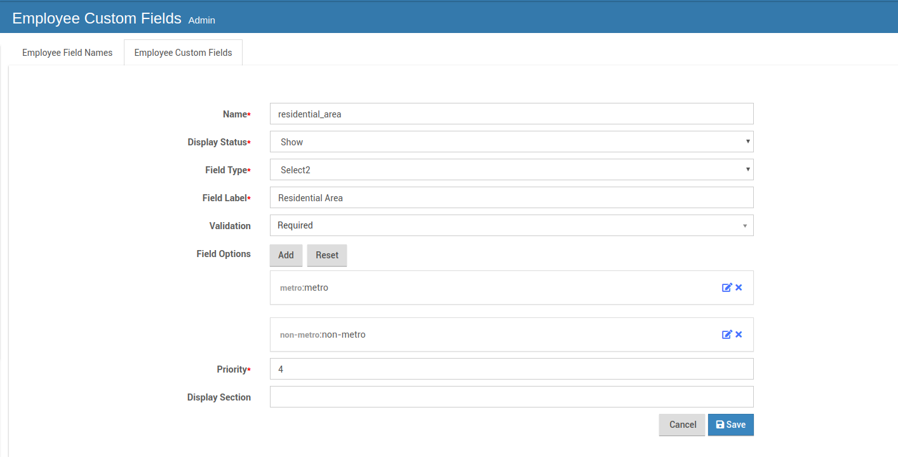

Now you can edit the residential area of each employee from **Employees => Employees**

You can use this data by selecting Get Employee data in Predefined Calculations. use residential_area in the Function field.

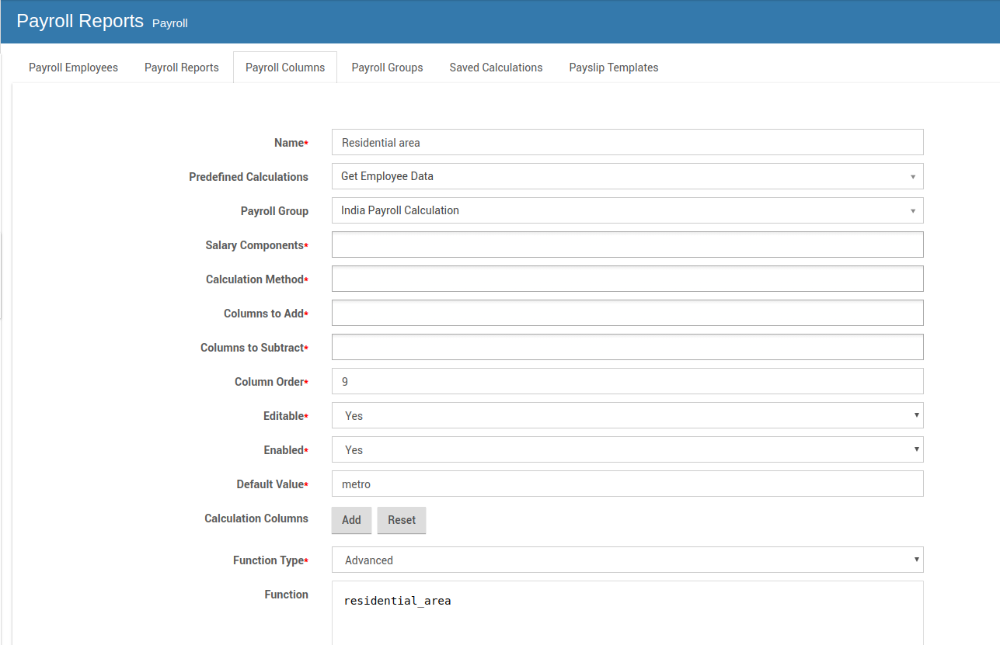

### Add Payroll Column for hra

You can add basic pay and residential area as calculation columns and write a function to find hra quite easily.

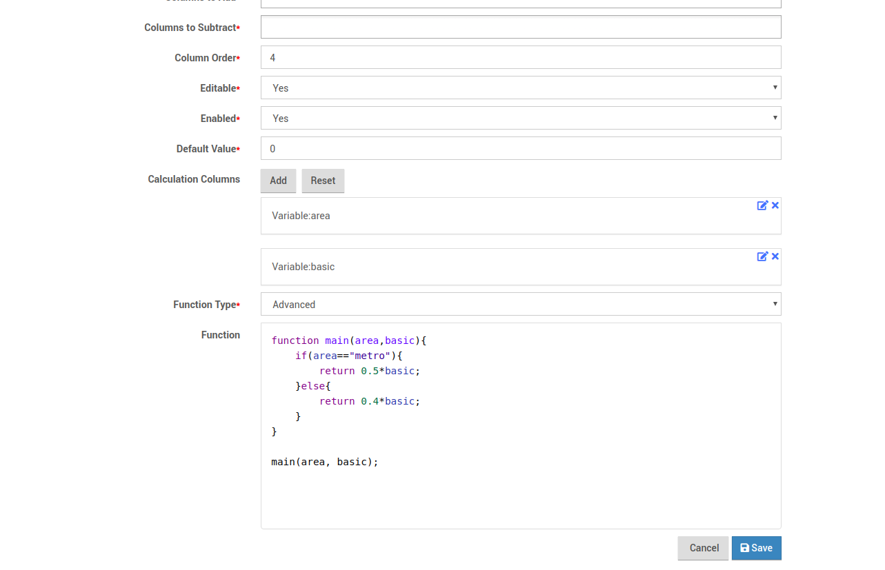

### Add Net Salary column

Net Salary is Gross salary minus Total deductions. So we create Net Salary column as shown below:

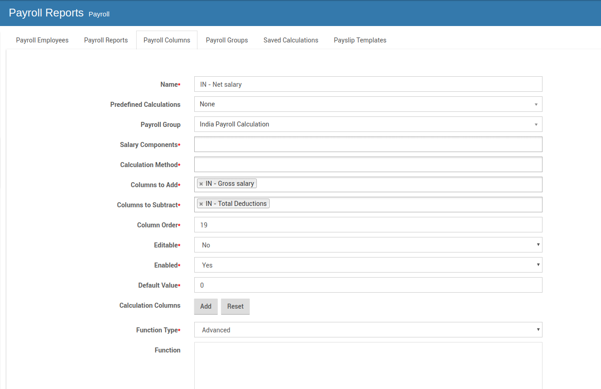

Now we have finished defining payroll columns. When you go to Payroll columns and search "IN - " you can see all the fields in Indian payroll.

## Create Payslip Template

As you have all the required payroll columns you can use these to create a payslip template. So we are going to create a new payslip template named Indian Payslip Template and add all the columns defined above. Goto Payslip Templates tab and create a new payslip.

A payslip template has can be created by adding following items:

1. Company Logo
2. Company Name
3. Text  \(For adding special messages to notifications to employees\)
4. Separators \(For separating sections on payslip\)
5. Payroll columns

Click on Add New button and create the payslip template as you want.

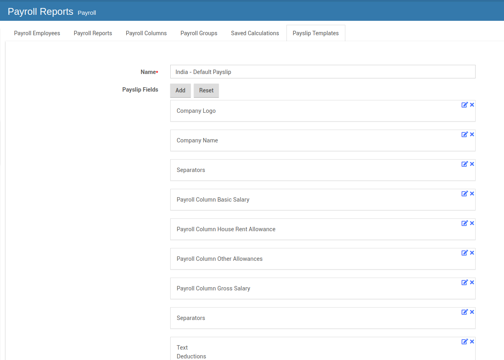

## Create Payroll Report

Payroll Report is the unit used to combine all the payroll columns and calculate monthly payments for all the selected employees.

Goto Payroll Reports tab and create a new Payroll Report.

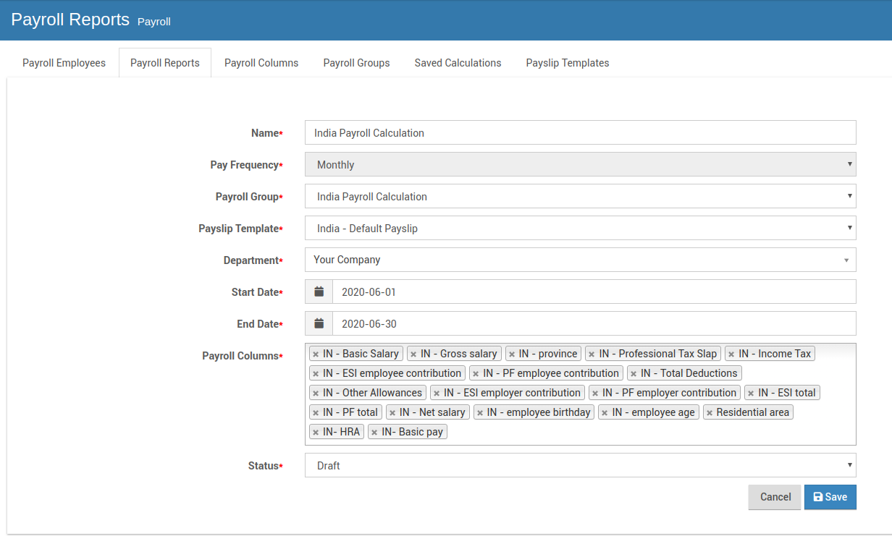

When you create the payroll report it should be in **Draft** state. Only when it is processing completed it should go to **Completed** state.

Also you need to select all the payroll columns you defined earlier for Indian payroll here as shown above.

## Selecting Employees For Your Payroll Report

Above payroll is for monthly paid employees who are in Indian Payroll Calculation group. So you need to add some employees satisfying above requirements under **"Payroll Employees"** tab.

As shown below we have added three employees to Indian payroll.

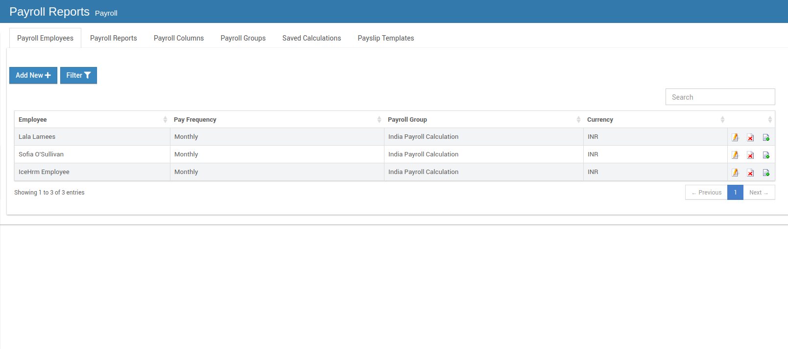

## Configure Employee Salary Components

Since the payroll depends on employee salary components you should make sure all employee salary components are defined properly. You can do this by going to **Payroll -&gt; Salary** module and selecting **Employee Salary Components** tab.

As we have configured our payroll report application now we are  able to calculate the tax and other payroll columns properly.

##Processing Payroll Report

Click on the blue color "Process" button on your payroll report under Payroll Report tab. This will show salaries of all the employees in your payroll. 

As you can see here IceHrm can now calculate your payroll.

After checking figures manually you can click on finalize button which will change the payroll report status to **Completed**.

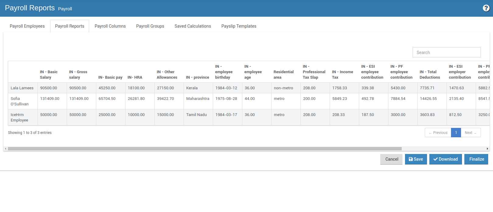

## Downloading Payslips

Now your employee can login and download payslip for the payroll period 2020-06-01 to 2020-06-30.

Login as the employee and goto **User Reports -&gt; Reports** module.

And then download the Payslip from any completed payroll report

Payslip for IceHrm Employee will look like this:

## Generating Payroll for Next Month

Once you configure your payroll for initially, generating it for the second month can be done in few minutes.

Clone a previous Payroll Report using Copy button.

Change Dates and set the Status to Draft.

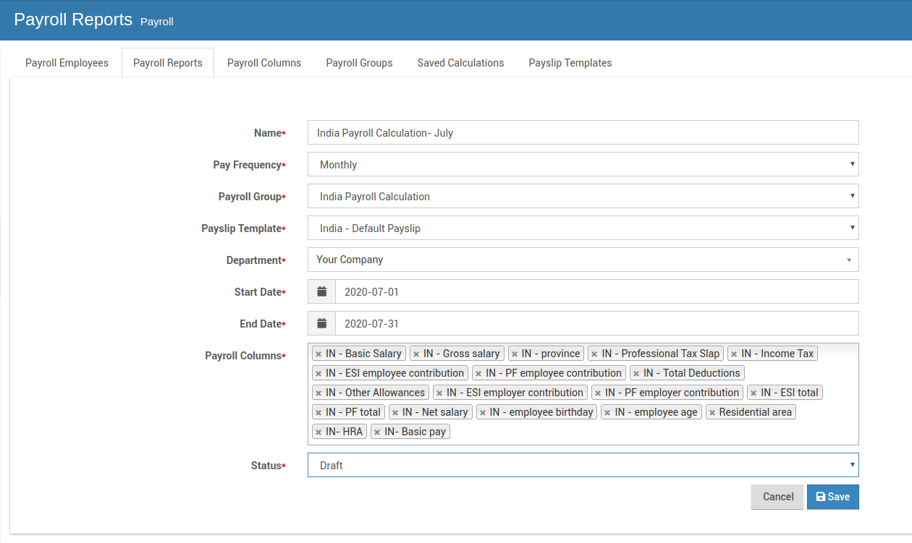

Then save the new Payroll Report and process and finalize it.
