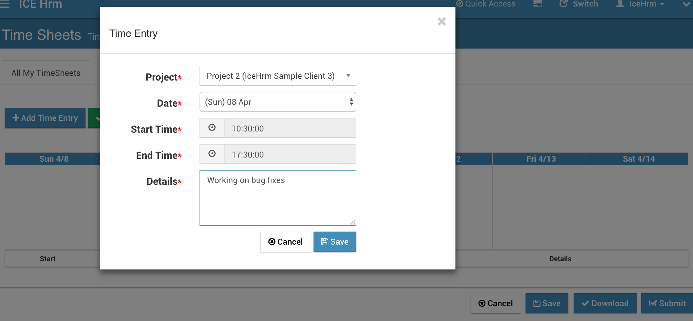

# Timesheets

Timesheet is a document that indicates the hours an employee has worked, separated by days of the week.

In IceHrm employees can edit timesheets under `Time Management => Time Sheets`. The current week timesheet is automatically created and timesheets for past weeks can be created by clicking the “Create Previous Timesheet” action button on a timesheet.

## Projects and Clients

Before starting to populate timesheets you should configure projects and clients. This can be done via `Admin => Project / Clients setup` tab.

Each and every project is attached to a client. Because of that, IceHrm allows adding clients with basic information. Once clients are added, you can start creating a project for these clients. The client section represents both external and internal clients of the company. That way you can attach each and every project to a client.

Note: IceHrm is not a project management tool. Because of that we only store minimum details about clients and project. This information is only used for Timesheets.

## Adding Time to Timesheets

Employees can edit timesheets via `Time Management => Time Sheets => All My Timesheets`

By clicking the edit timesheet button you can start adding time entries to the timesheet. Time entries are associated with projects. On each timesheet, you can add time for each project for each day of the week.

Here you can add your time. \(make sure to add time in hours as decimals. e.g: for 2 hours and 15 minutes you should add 2.25\)

Make sure to click the save button to save your changes to the timesheet. Total time in the timesheet list also updated according to your changes.

### Project List on Timesheet

By default all the defined projects under  `Admin => Projects / Client Setup` is displayed in timesheets of all the employees.

However, to limit only selected projects to an employee:

1. Set the value of `"Projects: Make All Projects Available to Employees"` setting under `System => Settings => Other` to "No"
2. Add only required projects to employees under `Admin => Projects / Client Setup => Employee Projects`

## View Timesheets

Timesheets details can be viewed by clicking on the view icon of any of your timesheets.

## Timesheet Approval

After adding your time entries you can submit your timesheet for approval. The supervisor should receive a notification.

Supervisor of the employee can view the timesheet under `Time Management => Time Sheets => Subordinate TimeSheets` and approve or reject it.

## Detailed Timesheets

In IceHrm there is an alternative way to add timesheets. This is useful if you want to add additional details like the task the employee was working on with the exact start and end time to the timesheet.

In order to activate this feature set the setting `"System: Time-sheet Entry Start and End time Required"` to "Yes" under `System => Settings => System` tab.

Then when the employee is editing the timesheet the view will be different and he/she should be able to add more details.

## Client Project Time Report

This is a very useful report based on timesheets to bill your client for the work your employee performed. Each employee can generate this report via  `User Reports => Client Project Time Report`.

