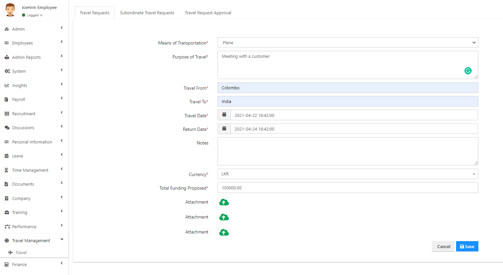
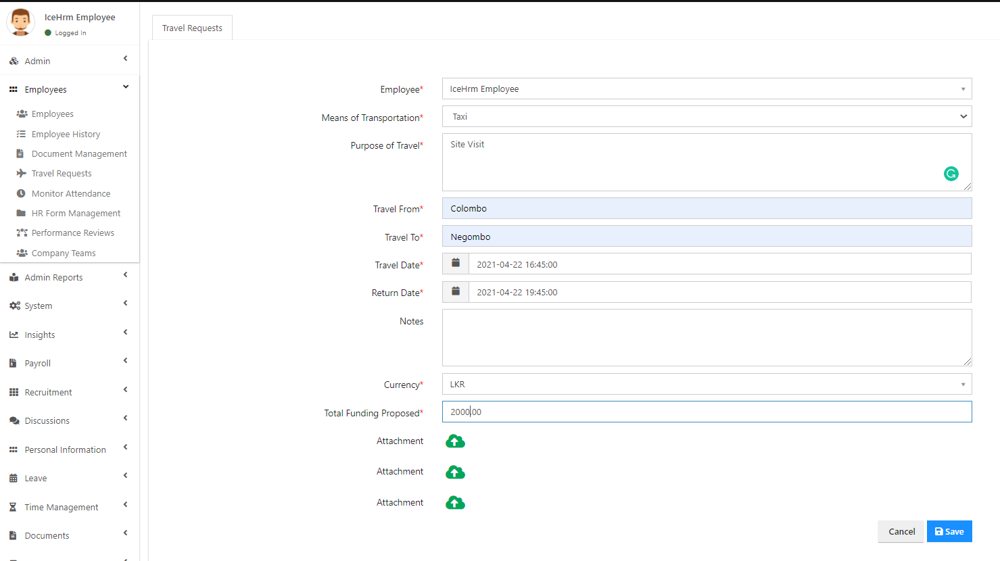
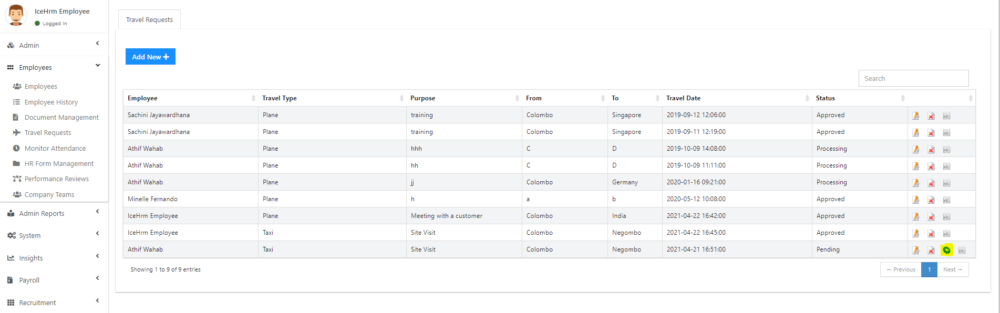
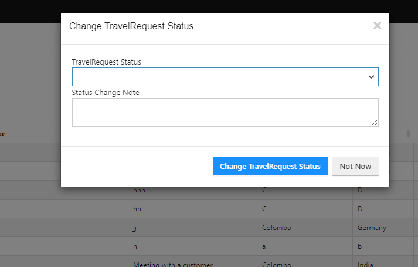
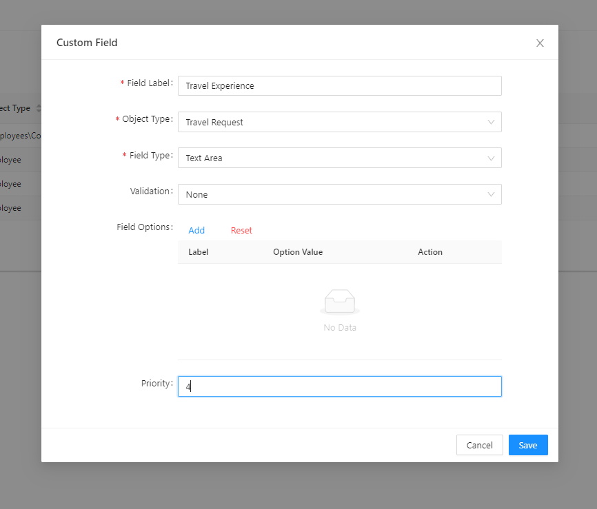

# Travel Module

## How to Create a Travel Request as an Employee

Employees can log into their [IceHrm](https://icehrm.com) accounts. In the **Dashboard**, they can find the **My Travel Management** module or they can go to the **`Travel Management Module -> Travel Request -> Add New`**

Then fill in the below fields to create a travel request.

* **Means of Transportation** — This means the methods of transportation
* **Purpose of Travel** — Employees can enter a detailed description of the purpose of travelling
* **Travel From** — Enter the start location of the travel
* **Travel To** — Enter the end location of the travel
* **Travel Date **— Enter the start date of the travel
* **Return Date** — Enter the end date of the travel
* **Currency **— Employees can choose a currency which they would like to get paid
* **Total Funding Propose **— They can enter the exact amount or an estimated amount of the expense of travel

> **Also, IceHrm has allowed you to attach proofs here. So the manager or the admin can investigate the real expense amount of travel with proofs.**

Once you click on the **Save **option, the supervisor of the employee will receive a notification stating that the employee has submitted a travel request.

## How to Assign a Travel Request as an Admin/Manager?

Admin/Manager can log into their IceHrm accounts. In the **Dashboard**, they can find the **Travel Request **module. Or Navigate to** Employees -> Travel Request -> Travel Request -> Add New**

1. You need to** fill the below fields** to create a travel request.

* **Employee **— You can select the employee to who you want to assign the travel request for
* **Means of Transportation** — This means the methods of transportation
* **Purpose of Travel **— Employees can enter a detailed description of the purpose of travelling
* **Travel From **— Enter the start location of the travel
* **Travel To** — Enter the end location of the travel
* **Travel Date **— Enter the start date of the travel
* **Return Date** — Enter the end date of the travel
* **Currency **— Employees can choose a currency which they would like to get paid
* **Total Funding Propose** — They can enter the exact amount or an estimated amount of the expense of travel

> When an admin or a manager assigns a Travel request, employees don’t need to get approval. It’s been already approved by the manager or the admin.

## How to **A**pprove a Travel Request as an Admin?

Admin/Manager can log into their [IceHrm](https://icehrm.com) accounts. In the **Dashboard**, they can find the **Travel Request **module or Navigate to** Employees -> Travel Request -> Travel Request**

**Click **on the **Change Status** option in blue colour.

Then Change** **the status to **Approved**, also you can add a **Note **before clicking on the **Change Travel Request Status **option.\

## How to Create a Custom Field to Travel Request

You can create a custom field to the Travel Request Form under the Admin account.

Navigate to `Admin -> Custom Field -> Add New`

Fill the below Necessary fields to create the new custom field:

1. Field Label: Enter the name of the custom field
2. Object Type: Select Travel Request as the object Type
3. Field Type: You can select the relevant Field Type according to the requirement of the custom field.

You can add a **Text Field**, **Text Area** or you can allow **Select Options** or **File Upload** or you can also allow entering **Date or Time.**

**\*\*\***_** **If you select the Text Area or Text Field, employees will be able to type a single sentence or multiple sentences in order to answer the question. If you select the Select option which means you can allow employees to select over options. You can add options under the next field which is Field Options._

You can see the created custom field under the travel request form.&#x20;
